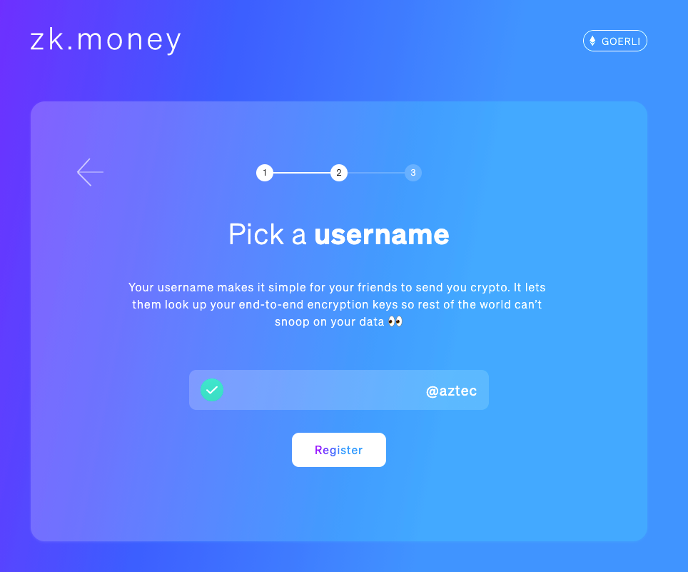
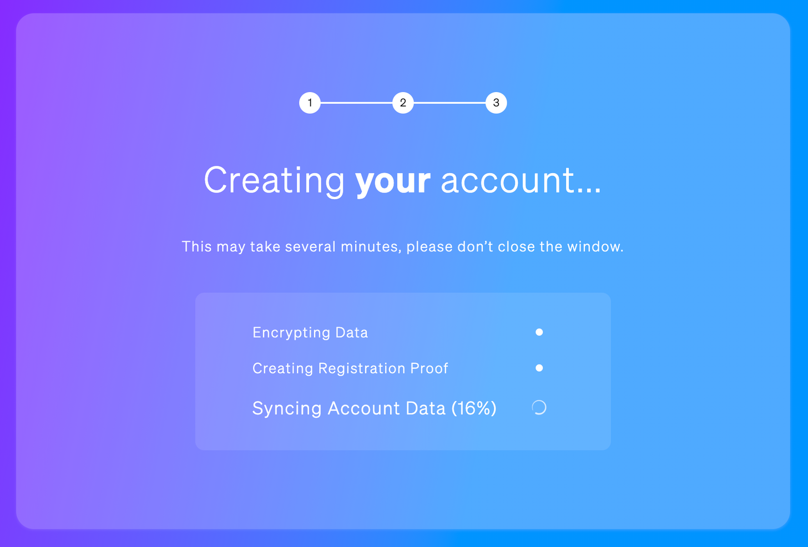
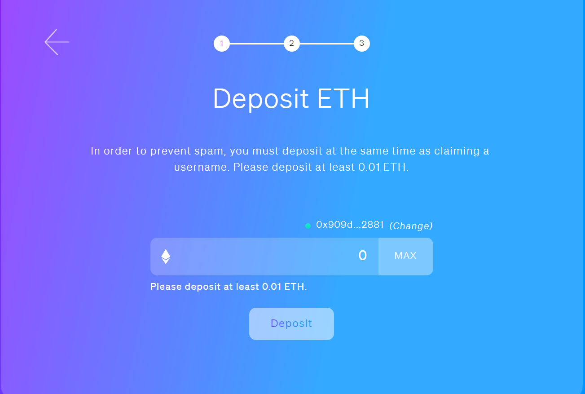
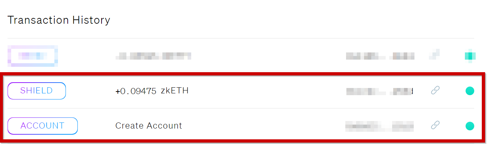
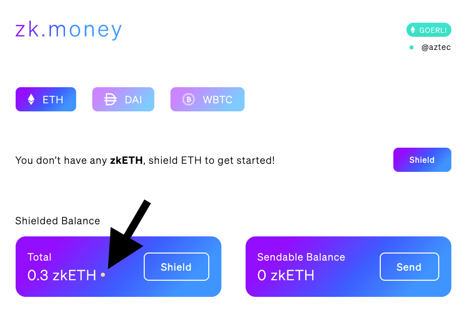
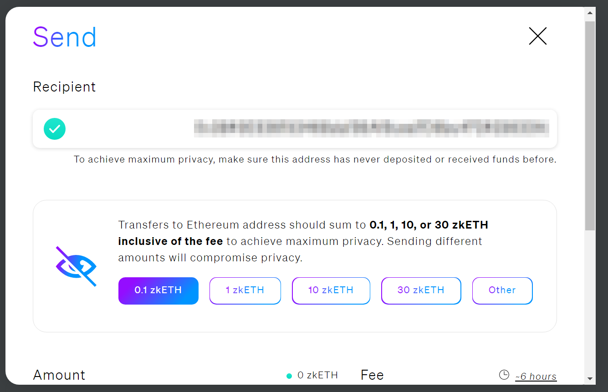
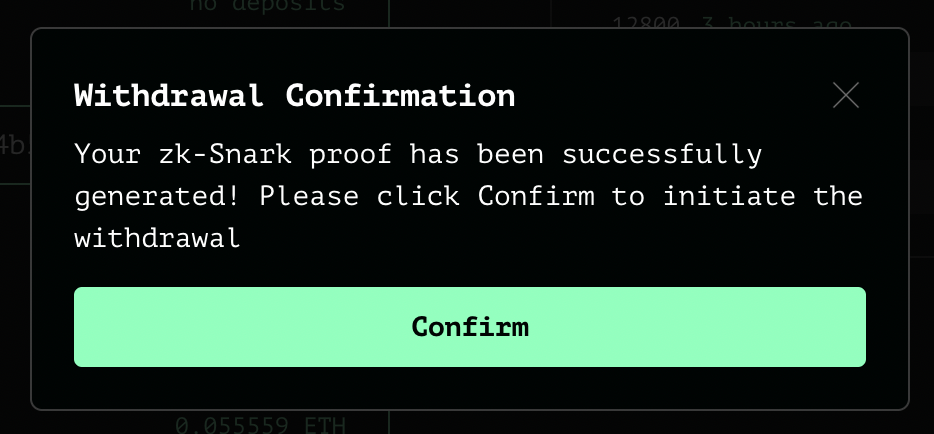

import AnonymizeETHIntro from './_how-to-anonymize-eth-intro.mdx';

# How to Anonymize Ethereum
<AnonymizeETHIntro />

### Step 0:  Create a fresh Ethereum account
First you will need to start off by creating a fresh Ethereum address. For clarity, we will call the wallet where your public non-anonymous ETH originates from `Wallet1`. 

To anonymize ETH, you must create a second fresh Ethereum account that is tied to a new seed. One way to do this, is to simply download [Metamask](https://metamask.io) on a different browser and create a brand new seed. It is important to use an entirely different seed to `Wallet1` to minimize the risk of linking the accounts.

If you want to be highly secure, download Metamask on [Tor Browser](https://www.torproject.org/download/) (do not use a VPN when you are interacting with Tor as it will reduce your overall anonymity). If you don't use Tor, use a browser like Brave or Firefox alongside a VPN.

Once you have downloaded Metamask on this new browser, create an account and backup your seed. Copy and paste your account's public key onto a text file. We'll use this later on. We will now refer to this account as `Wallet2`.

## Anonymizing ETH using zk.money
:::warning  Warning
This zk.money guide was written using the old version of zk.money. We believe it may work similarly, but we apologize if there are some mistakes. Feel free to update the guide and help maintain this resource.
:::

The steps in this guide will take a few minutes to complete, but it will take about 6 hours until you can transact with your private, "shielded" ETH. 

Once you have created your fresh Ethereum wallet `Wallet2` [described in Step 0](#step-0--create-a-fresh-ethereum-account), you can proceed with the rest of this guide.

_Note: Tor is not compatible with zk.money, so it's recommended to use a VPN instead._

### Step 1: Connect to zk.money and pick username
On the browser associated with `Wallet1`, navigate to the [zk.money](https://old.zk.money/) website. Connect `Wallet1` to zk.money. Pick a username to set as your alias.

Then click 'Register'. This may take several minutes. Do not close the window until you see the dashboard.

Deposit at least 0.01 ETH for the username registration to be complete. You'll be able to withdraw your ETH later or include them in a payment.

### Step 2: Shield your Ethereum
Now convert your ETH to zkETH by shielding your coins. Shield your preferred asset by clicking the “Shield” button on your dashboard. You can reduce the time the shielding will take by paying a higher transaction fee here. 

Keep waiting until the `SHIELD` and `CREATE ACCOUNT` transactions are settled. Only then is your username successfully registered. This may take a few hours. 

You’ll be able to follow your transaction status in the dashboard. Please note that while your account balance may show zkETH available, you won’t be able to send any funds until your new sendable balance is settled.

Once you have a sendable balance of zkETH you will be in privacy mode. The entire process may take several hours, so don’t stress if the balance does not show up immediately.

### Step 3: Send anonymized ETH to fresh wallet
Now that the ETH has been anonymized, send it to `Wallet2`. Simply paste the `Wallet2` address into the *Recipient* section.

The coins received by `Wallet2` will be normal ETH (as opposed to zkETH). However, the transaction history will have been anonymized. Etherscan will show the funds were sent from the Aztec contract to `Wallet2`.

`Wallet2` is now an anonymous account you can use that isn't tied to any of your past Ethereum transaction history (remember to use it in combination with Tor or a VPN for increased anonymity).

<!--
## Anonymizing ETH using Tornado Cash
Now we will walk through the process of anonymizing ETH through Tornado Cash. This guide does not deal with Tornado Cash Nova - the new experimental version of Tornado Cash. Make sure your are on the right version of the app.

Depending on the ETH gas price, an average Tornado Cash deposit costs around 0.05 ETH (plus a similar amount for withdrawal). If you'd like a cheaper alternative, check out the [process for zk.money](#anonymizing-eth-using-zkmoney).

Once you have created `Wallet2`, you can proceed with the rest of this guide.

### Step 1: Deposit to Tornado Cash

On the browser associated with `Wallet1`, navigate to [Tornado Cash](https://tornado.cash). Click 'Launch App' in the top right hand side. Now follow the steps to deposit ETH.

Select ETH from the token list and enter your required amount. Now connect your wallet. Click on `Connect` and choose Metamask.
Save your note. Click on `Deposit` and store your note on a secure place before clicking on `I backed up the note`. 
You can also save encrypted notes on-chain by setting up a Note Account, by clicking on `Settings` (top-right corner).

Your ETH is now being anonymized. Leave it here for as long as you can. The longer you wait, the greater your anonymity set will be.

### Step 2: Send anonymized ETH to fresh wallet
Now we are going to redeem anonymous ETH on `Wallet2`. First navigate to `Wallet2`. If you are running it on Tor, switch off your VPN. Otherwise, close your current browser and turn your VPN on.

In `Wallet2`, use your deposit note by clicking `Deposit` and pasting it in the corresponding box. Click on `Withdraw` and wait for the zk-SNARK proof to be generated.

Finally, confirm the withdrawal. `Wallet2` is now an account you can use, loaded with ETH, that isn't tied to any of your past Ethereum transaction history.

-->

#### Disclaimer:
*This tutorial is for informative purposes only. We make no representation as to the tutorial's accuracy, usefulness,  or completeness. As a consequence, the above tutorial is offered to you without any warranties.  We are not liable for any claims, losses, damages, judgments, fines, litigation costs, and/or legal fees arising out of or in connection with your use of the information provided or any other action or transaction related thereto.* 

*This tutorial is not presented as, nor should it be construed as, an endorsement of zk.money.  In addition, this tutorial is not presented as, nor should it be construed as, a recommendation to engage in any transaction or taken as the basis for making decisions. By viewing the above tutorial, you acknowledge and agree that you are solely responsible for your own transactions and decisions (“Your Actions”), and that we are not responsible for Your Actions or the consequences thereof.*