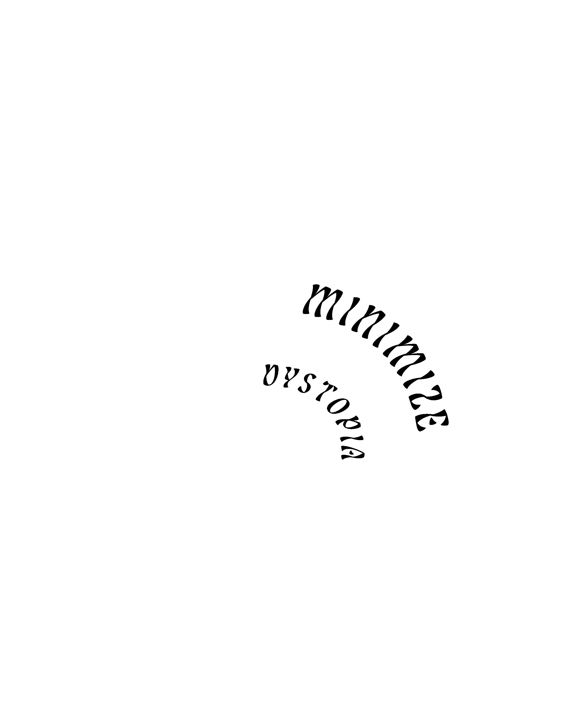

# Issue 00000000
###### April 2022

--- 

--- 
Black Sky Nexus includes educational guides, in-depth inquiries, informational articles, in addition to comedic or sci-fi extrapolations for the purpose of developing relevant resources to promote greater engagement and community around the following topics: large-scale networks of cooperation; open source resources for new crypto explorers; the role of technology and privacy in the evolution of human rights; how crypto can benefit the arts and vice versa; new modalities for healing the ecosphere; humanity’s relationship with the cosmos. ([Learn more about these topics here](https://www.blacksky.network/nexus).)

 In addition to being a digital resource, Black Sky Nexus has plans to materialize as a print publication in the future. As we are beginning to pursue funding opportunities for this project, we have prepared a *preview* of Black Sky Nexus: `Issue 00000000`. We also invite you to join the [Black Sky Discord](https://discord.gg/TrFzBxzCHH) to have discussions on our articles and initiatives. (Note: if you purchase one of the NFTs from the featured artists, 50% of the profits go toward Black Sky Nexus)

--- 
<a href="../../zine/00000000/that-one-time-i-attended-ethdenver">That One Time I Attended ETHDenver Not Knowing What a Blockchain is...</a>

###### By E. Øss 
--- 
<a href="../../zine/00000000/transformative-autonomous-organizations">Transformative Autonomous Organizations</a>

###### By Stellar Magnet
---
<a href="../../zine/00000000/validate">ValiDATE: A Sexual Health Ledger</a>

###### A Word From Our Sponsors
---
<a href="../../zine/00000000/interstellar">Interstellar</a>

###### By Giulio Prisco
--- 
<a href="../../zine/00000000/how-to-anonymize-eth">How to Anonymize Ethereum</a>

###### By Rachel-Rose O'Leary, Stellar Magnet
--- 
<a href="../../zine/00000000/zentaipunks">Zentaipunks: A Rhizomatic Collaborative Jam Exploring Privacy and the Erasure of Identity</a>

###### By Sun Deep
---
<a href="../../zine/00000000/sun-deep">Sun Deep: Black Sky's First Artist in Residence</a>

###### By Black Sky Nexus
---
<a href="../../zine/00000000/dopplereffekt">Traversing Neurotelepathic Wormholes with Dopplereffekt</a>

###### By Black Sky Nexus
---
<a href="../../zine/00000000/attila-csihar">Attila Csihar Channels Dark Saturnalian Energy in Avant-garde Performance</a>

###### By Black Sky Nexus
---
<a href="../../zine/00000000/crypto-legal-risk-checklist">Crypto Legal Risk Checklist</a>

###### By Fatemeh Fannizadeh, Silke Noa

