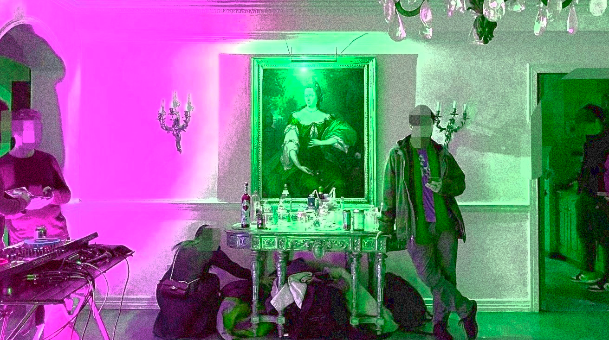

# I Attended EthDenver Not Knowing What a Blockchain is...
And Left with Omicron and Hard Respect for the Crypto Community

###### By E. Øss

Denver, Colorado - Feb 2022: I’m attending ETHDenver for the first time and I don’t even know what a blockchain is. By the time I leave this conference, I will have a vague but growing understanding of what a blockchain is as well as a positive case of COVID-19 I most definitely obtain at a mansion rager with other conference attendees. So bear with me, and enjoy the ride (or don’t, and don’t; it’s up to you). 

For some context: I’ve spent the last two years living alone in the desert during the pandemic. My daily life is simple: I remotely operate a chatbot that schedules appointments part time and do remote freelance work another part of the time. I’m also a fiction writer and a painter for the other parts of the time. The core of what I do is multiple side hustles out of my studio apartment where I live with my cat Dennis who is abnormally small and especially whiney (I do love him).

My only pre-conference experiences with crypto counter culture are 1) my older brother berating me over the last decade that I “should really invest in crypto” when he has yet to invest himself and 2) I’ve recently done some freelance editing work for an emerging DAO and was paid in crypto for the first time, in DAI, a stable coin, the money I immediately transferred into US dollars because I’m too afraid to ride the waves. 

You see, I’m a long term starving artist. I don’t have health insurance. I haven’t been to a dentist in years (thanks sensodyne, flossing, oil pulling, and fervent prayer my teeth don’t break). I’m staunch about staying out of debt and living frugally. And look, I’m not complaining; for a literary writer, this is one example of what it looks like to build a career. You spend a decade trying to master your artform while slowly and intermittently passing through important, narrow gates. Even now, I’m largely a nobody with a few impressive credentials. The story collection I’m currently revising with my agent will be pitched to publishing houses for around 50k tops, probably less. What publishing houses really want is novels that can be adapted into films, not collections full of neurotic characters with obsessions, addictions, repressed emotions, and compulsions to, say, set themselves on fucking fire (if you grew up in the American Midwest like I did, you might feel me on that). 

So here I am attending ETHDenver as a person who has a cautious, healthy respect for not having much money and never knowing if/when I will. At this conference people will be talking a lot about currency, what people do with their currency, how currency goes up and down in value, the investment of currency, how people put a lot of currency into NFTs, that there are these huge crypto-based financial entities called DAOs that don’t have CEOs and instead operate around the votes of members who have invested, you guessed it: currency. 

During the week of the conference I will hear the following words/terms over and over: “crypto,” “crypto currency,” “blockchain” “DAOs,” “metaverse,” “NFTs.” 

For an outsider, it’s a lot to take in, a whole subculture that rests on at least understanding what blockchain technology is — if you don’t understand blockchain, nothing else will make sense. Blockchain is the foundation upon which this whole counter culture has been built and  continues to evolve and grow. It is the origin of crypto controversy (blockchain uses A LOT of electricity to operate) as well as the passageway to providing greater financial freedom and privacy. So, as with most things that are high stakes for humanity: a double edged sword. 

---

