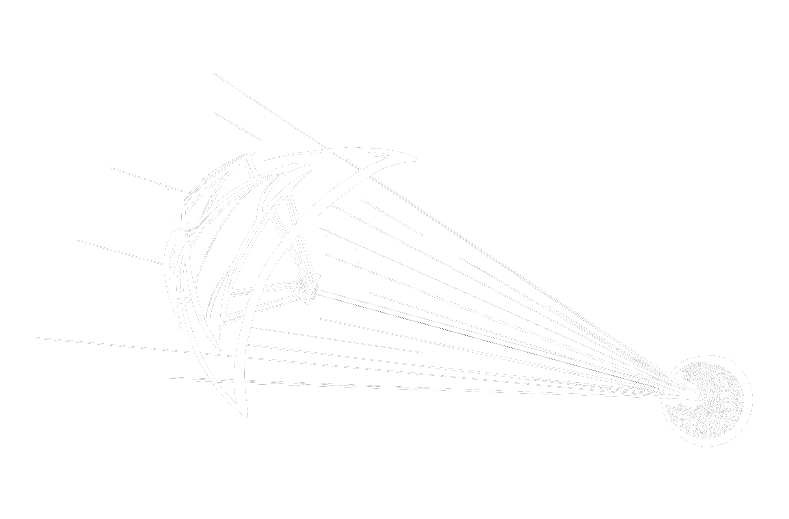

import ImgUp from '@site/static/img/dec_up.svg';
import ImgDown from '@site/static/img/dec_down.svg';
import Header from '@site/docs/img/interstellar.png';


# Interstellar
###### By Giulio Prisco

<ImgUp className="img-up" />
<div class="header"></div>
<ImgDown className="img-down" />


Some people think that we should abandon our dreams to go to the stars. Interstellar spaceflight, they say, is impossible.

I call bullshit. Don’t forget that, only a few years before the Wright brothers, respectable scientists claimed that airplanes were impossible.

Advances in space propulsion will enable “even interstellar missions,” notes Martin Tajmar [Tajmar 2003].

> “And there are even more fantastic ideas around that will probably enable us to master gravitation itself and revolutionize space travel…”

Incremental technology improvements and streamlined use of resources will open the interplanetary frontier. But for the interstellar frontier, we’ll need better space propulsion technologies.

The book *“Frontiers of Propulsion Science”* [Millis 2009] presents recent advances in propulsion technology, and promising research steps to discover how radical propulsion breakthroughs might finally be achieved. In *“Centauri Dreams”* [Gilster 2004], Paul Gilster provides an overview that remains one of the best references on interstellar spaceflight, including the propulsion technologies outlined below.

The same propulsion technologies that our interplanetary descendants will use to move efficiently through the solar system, such as nuclear fission or more likely nuclear fusion, perhaps using fuels laced with antimatter to make fusion more efficient, could take us to the nearest stars if we are willing to wait long enough. Multi-generation starships able to reach the nearest stars in centuries could be built with moderate technological improvements.

But, even with efficient fusion propulsion, a faster starship would have to carry too much fuel to be viable. Antimatter propulsion [Forward 1995], much more efficient than nuclear fusion propulsion, would permit accelerating a starship to a significant fraction of the speed of light (ten percent or more), and decelerating to stop at the destination, with realistic amounts of fuel on board.

Antimatter powered starships could reach the nearest stars in decades instead of centuries. We are unable to produce the required amounts of antimatter at this moment, but things could change. 

The Bussard ramjet wouldn’t have to carry fuel. Instead, it would collect fuel on the fly by using magnetic fields to scoop the atoms present in interstellar space. As noted by Carl Sagan [Sagan 1966], the concept is very elegant and could be a game changer. While the original idea of Robert Bussard is out of fashion at this moment, some promising variants are worth pursuing.



Light sails pushed by focused laser or microwave beams in the solar system [Drexler 1986, Forward 1995, Loeb 2021] would also permit accelerating interstellar starships without fuel on board. The fuel would remain at home, so to speak, and there are apparently viable ways to decelerate and stop at the destination. Combining the technologies used in Bussard ramjets and light sails, we can think of magnetic sails [Zubrin 2019] that use a magnetic field as a sail pushed by the solar wind or a particle beam.

Instead of beaming radiation or particles to propel a sail, we can think of shooting fuel pellets at a starship. Or even better, we can think of pre-positioning fuel pellets along the path of a starship to provide an acceleration runway in the solar system.

While requiring improvements in technology, these interstellar propulsion systems sit comfortably within mainstream consensus science. Other more imaginative propulsion systems could rely on reactionless drives based on the hypothetical possibilities of pushing against the quantum vacuum, tapping the “zero point energy” [Forward 1995, Tajmar 2003] that is present in empty space, or rowing through empty space by inducing variations of inertial mass as suggested by James Woodward [Cramer 2013, Woodward 2013]. According to John Cramer, Woodward’s theory “could have important general relativity implications” for the warp drives and wormholes discussed below. 

Future spacefarers could travel among the stars in style. Really in style. Faster than light.

After Einstein, consensus physics has ruled out the possibility of moving through space faster than light. But space itself can move faster than light, as in the early “inflationary” phase of the expansion of the universe. Empty space is not a nothing, but a something that can be shaped by matter and energy consistently with Einstein’s general relativity. The Alcubierre warp drive [Cramer 2013] would allow “to ‘inflate’ the space in back of a starship… and to ‘deflate’ the space in front of the starship” [Forward 1995], transporting the starship like a surfer carried by a faster than light wave of space.

```
     ________________________________         
    /                                "-_          
   /      .  |  .                       \          
  /      : \ | / :                       \         
 /        '-___-'                         \      
/_________________________________________ \      
     _______| |________________________--""-L 
    /       F J                              \ 
   /       F   J                              L
  /      :'     ':                            F
 /        '-___-'                            / 
/_________________________________________--"  


Henry Segerman
```

Traversable wormholes [Thorne 1994, 2014, Cramer 2013] that would allow, so to speak, to go around space rather than through it, are also entirely consistent with Einstein’s general relativity. A traversable wormhole would provide a faster than light path between its two ends separated in space. It’s worth noting that, under certain conditions, suitably arranged wormholes would also allow time travel to the past.

Using warp drives or traversable wormholes for spaceflight would require the ability to engineer exotic forms of matter and energy that, while apparently consistent with physics, are entirely beyond us at this moment. But not necessarily beyond a very advanced civilization “whose activities are limited only by the laws of physics” [Thorne 1994]. Hopefully, we will become a very advanced civilization ourselves.

Today, many scientists and science fans seem committed to an all-out war on imagination in the name of excessive caution. They have knee-jerk reactions when they hear about highly imaginative ideas such as faster than light warp drives or time travel, and accuse highly imaginative colleagues of being “crazy science fiction physicists” [Thorne 1994].

I guess this is a residual of past struggles to free science and society from some toxic effects of religious dogmatism, but these “scientific justice warriors” throw out the baby with the dirty bath water. Their warped logic seems to be that scientific optimism and speculative frontier science open the door to anti-scientific thinking and threaten to bring back magical thinking or even (God forbid) religion.

But Avi Loeb rightly warns [Loeb 2021] that:

> “The tenuous threads connecting humanity’s Earth-bound civilization as it exists today, and the promise of humanity’s possible interstellar civilization as it might exist tomorrow, will not be upheld by exercising conservative caution.”

The 100 Year Starship project [Benford 2013] strives to make human interstellar spaceflight a reality within the next 100 years.

I’ll now outline two interstellar mission projects that have been proposed and could be enabled by technology developments that can be expected to materialize soon. One wants to send ultra-light miniaturized probes to the nearest star and return data after only a few decades. Another wants to send a probe, which could one day be followed by people, to a very interesting destination at the edge of interstellar space.

The Breakthrough Starshot project [Loeb 2021] wants to send the first robotic probes to the nearest star, Alpha Centauri, in only a few decades and with only a few decades of travel time.

If things go according to plans (things seldom do, but optimism feels good), some readers will be alive when the first data and images come back from the Alpha Centauri system.

Starshot is the first interstellar probe project with sufficient funding for a thorough feasibility study. In fact, initial $100 million funding was provided by Russian billionaire Yuri Milner. At the Starshot announcement event in April 2016, Stephen Hawking said:

> “The limit that confronts us now is the great void between us and the stars. But now we can transcend it. With light beams, light sails and the lightest spacecraft ever built, we can launch a mission to Alpha Centauri within a generation. Today, we commit to this next great leap into the cosmos. Because we are human. And our nature is to fly.”

The key elements of Starshot are based on technology either already available or likely to be attainable in the near future under reasonable assumptions, and the Alpha Centauri mission is expected to require a budget comparable to the largest current scientific experiments: the total funding needed would be of the order of $5-10 billion, which seems ambitious but possible.

The star probe will be a highly miniaturized system on a chip, propelled by a light sail built with advanced nano-engineered materials. The probe and its light sail, both weighing only a few grams, will be pushed by light beams from high power lasers, accelerated to 20 percent of the speed of light, and reach Alpha Centauri in two decades. There’s no room for a deceleration system, so the mission will be a high speed fly-by with the goal of returning data and images.

Among the many Starshot system design challenges, data return is expected to be one of the hardest, because there is little room for a communication system able to send data back to Earth.

A first stepping stone on the road to the stars could be a mission to establish a gravitational lens observatory in deep interstellar space, at about three light days from the Earth. This is the distance of the gravitational focus of the Sun, where gravitational lensing provides a huge amplification of signals from the opposite direction (the Sun must be between the observatory and the target). Carl Sagan explains [Sagan 1994]:

> “If you are free to roam an imaginary spherical shell at the appropriate focal distance and centered on the Sun, you are free to explore the Universe in stupendous magnification, to peer at it with unprecedented clarity, to eavesdrop on the radio signals of distant civilizations, if any, and to glimpse the earliest events in the history of the Universe. Alternatively, the lens could be used the other way, to amplify a very modest signal of ours so it could be heard over immense distances.”

Perhaps we need a gravitational lens router in place if we want to join the galactic internet of distant civilizations. Claudio Maccone has proposed [Maccone 2009, 2012] to get started with a first exploratory mission, called FOCAL, to the gravitational focus of the Sun.

It’s worth noting that a gravitational lens observatory pointed at Alpha Centauri could permit receiving the faint signals sent back from the small, low power transmitters of Starshot probes. Therefore, a FOCAL mission could be an important element of Starshot.

In *“Aurora”* [Robinson 2015], Kim Stanley Robinson imagines the first human interstellar mission, launched in 2545. The story starts in a large multi-generation starship with more than two thousand human starfarers en route to Tau Ceti at one tenth of the speed of light, then moves to Aurora, an Earth-like moon in the Tau Ceti system.

*“Aurora”* is a fascinating interstellar adventure, with plausible pictures of interstellar propulsion and a quantum computer slowly waking up to sentience. But the hard problem is biology.

Robinson argues that a multi-generation starship would be too small to include a viable ecosystem able to support life for hundreds of years, and would inevitably fail. Another problem is that “If it’s alive it’s going to be poisonous.” A nasty alien micro-organism found on Aurora, from which there is no defense, threatens to exterminate the starfarers and eventually forces them to head back to the Earth.

I find Robinson’s scenario excessively grim to the point of inconsistency. For example, the starfarers have powerful nanotechnology that can analyze and engineer matter at molecular scales. I find it strange that they are unable to use their nanotechnology to stabilize life support on the starship and fight the alien pathogen on Aurora.

In *“The Next 500 Years”* [Mason 2021], inspired by recent advances in synthetic biology and genetic engineering, Christopher Mason suggests that we will eventually engineer human DNA to enable future generations to settle other planets in the solar system and around other stars. Genetically modified humans could be adapted to live on the surface of other planets or in engineered habitats and interstellar starships.

Another possibility is to upload human minds to advanced computers in a starship. Computers don’t require air, water, food, or medical care, and withstand acceleration and radiation much better than organic bodies. Therefore, the size and weight of the starship can be dramatically reduced.

Future technologies [Kurzweil 2005, Bainbridge 2007, Prisco 2020] like nanotechnology, neurotechnology and mind uploading (personality transfer) could be the ultimate enablers of interstellar spaceflight and human expansion to the stars. The minds, personalities, memories, and feelings of the crew members would be moved to computing circuitry on board.

I’m not saying that today’s digital technologies can process human consciousness and “run” uploaded human minds. I don’t think this is the case. But I’m persuaded that future technologies will reproduce the yet poorly understood features that enable biological brains to process consciousness. New kinds of computing circuitry, perhaps advanced quantum chips, will be able to run uploaded human minds.

Once the interstellar destination is reached, the uploaded minds of the crew members would be moved to suitably designed nano-printed bodies. Perhaps one of the first tasks of the crew could be the construction of receivers for other spacefarers, who will then join the interstellar outpost traveling as radiation and light beams.

With these technologies, the galactic network of gravitational lens routers outlined above would also be a galactic transportation network. In the science fictional universe of *“Manifold: Space”* [Baxter 2000], Stephen Baxter explores this possibility.

If strong Artificial Intelligence (AI) [Kurzweil 2005, Bainbridge 2007, Prisco 2020] is developed, perhaps way smarter than humans [Lovelock 2019], why should we bother to send uploaded human minds to the stars? Isn’t AI good enough?

One answer is that we want human minds among the stars. Another answer is that future people will be human/AI hybrids [Kurzweil 2005], blended so tightly that it will be impossible to tell which is which.

Of course we’ll meet alien civilizations among the stars [Sagan 1966, Freitas 1979]. We haven’t found confirmed evidence of extraterrestrial life yet, but I’m persuaded that the universe is structured in such a way that conscious intelligent life (perhaps much different from life as we know it [Freitas 1979, Vidal 2014]) inevitably emerges and thrives.
```
     _                      _______                      _
  _dMMMb._              .adOOOOOOOOOba.              _,dMMMb_
 dP'  ~YMMb            dOOOOOOOOOOOOOOOb            aMMP~  `Yb
 V      ~"Mb          dOOOOOOOOOOOOOOOOOb          dM"~      V
          `Mb.       dOOOOOOOOOOOOOOOOOOOb       ,dM'
           `YMb._   |OOOOOOOOOOOOOOOOOOOOO|   _,dMP'
      __     `YMMM| OP'~"YOOOOOOOOOOOP"~`YO |MMMP'     __
    ,dMMMb.     ~~' OO     `YOOOOOP'     OO `~~     ,dMMMb.
 _,dP~  `YMba_      OOb      `OOO'      dOO      _aMMP'  ~Yb._

             `YMMMM\`OOOo     OOO     oOOO'/MMMMP'
     ,aa.     `~YMMb `OOOb._,dOOOb._,dOOO'dMMP~'       ,aa.
   ,dMYYMba._         `OOOOOOOOOOOOOOOOO'          _,adMYYMb.
  ,MP'   `YMMba._      OOOOOOOOOOOOOOOOO       _,adMMP'   `YM.
  MP'        ~YMMMba._ YOOOOPVVVVVYOOOOP  _,adMMMMP~       `YM
  YMb           ~YMMMM\`OOOOI`````IOOOOO'/MMMMP~           dMP
   `Mb.           `YMMMb`OOOI,,,,,IOOOO'dMMMP'           ,dM'
     `'                  `OObNNNNNdOO'                   `'
                           `~OOOOO~'   TISSUE
```


Interstellar futures have been imagined by many science fiction writers, with plenty of detail. Unfortunately, most vintage science fiction doesn’t feel credible today because it portrays people like us and societies like ours, only with futuristic technologies. This is, I think, far too naive.

Greg Egan envisions less naive interstellar futures in [Egan 2002, 2008]. Orion’s Arm, a collaborative project to imagine plausible interstellar futures, has produced a really spectacular science fictional universe. Besides published collections of short stories e.g. [Orion’s Arm 2014] and a novel [Bowers 2012], the project maintains a sprawling website at [orionsarm.com](https://orionsarm.com). The website includes an *“Encyclopaedia Galactica”* with thousands of entries and counting.

The Orion’s Arm project was started in 2000 by Alan Kazlev and Donna Hirsekorn, who “wanted stories set in a future which might really happen” [Orion’s Arm 2014]. I was involved in a project to create a virtual world based on Orion’s Arm. This project eventually stalled, but I hope others will continue it.

The Orion’s Arm universe, set ten thousand years from now, spans thousands of light years with countless worlds and space habitats. People range from “near baseline” to heavily modified humans with all sorts of body plans and embedded technology, including superhumans with extremely advanced augmentations and AI subsystems. Most people are virtual beings living as pure software.

Engineered wormholes are used for long distance interstellar hauls, but wormhole physics doesn’t allow using wormholes for time travel. A few alien civilizations have been found, but none advanced as humans. There are, however, clues that suggest very advanced alien civilizations that existed in the past.

Directed superhuman evolution has produced vast God-like beings with mega brains, internally connected by instantaneous wormhole links, which span star systems and light years. Only these beings can understand and create some extremely advanced technologies used in Orion’s Arm.

This short outline doesn’t even begin to do justice to the vast complexity of Orion’s Arm. Visit [orionsarm.com](https://orionsarm.com) for much more. Or even better, participate in the project. I can promise that Orion’s Arm will give you awesome dreams and a burning enthusiasm for our interstellar future.

:::note Read More
This is an excerpt from my book *Futurist spaceflight meditations*. I invite you to [read the rest of the book](https://docs.google.com/document/d/1cquZcFtfcJcubOfeIIKgoGTNepGxxykwX610r0Judqg/edit) or [purchase a copy](https://www.amazon.com/Futurist-spaceflight-meditations-Giulio-Prisco/dp/B096LPPVSR/ref=tmm_pap_swatch_0?_encoding=UTF8&qid=&sr=).
:::