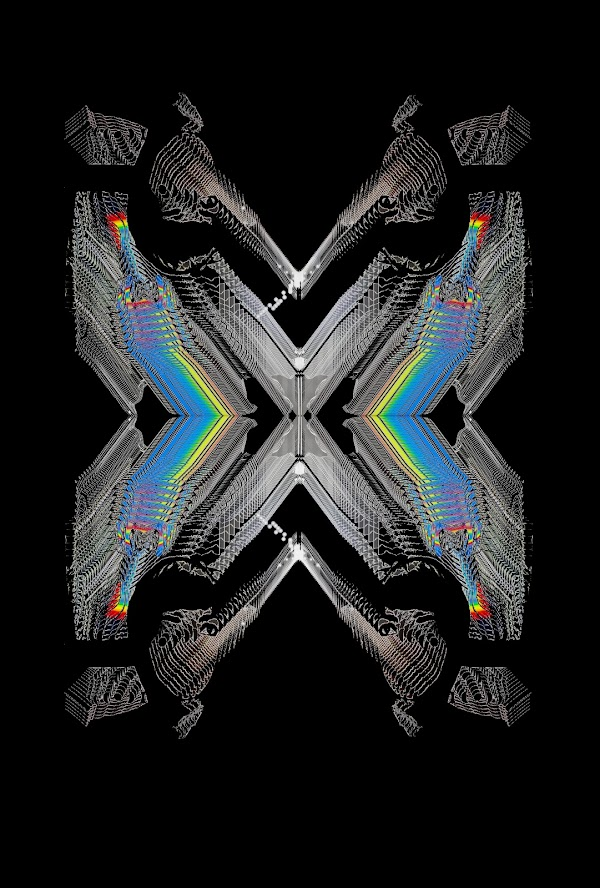
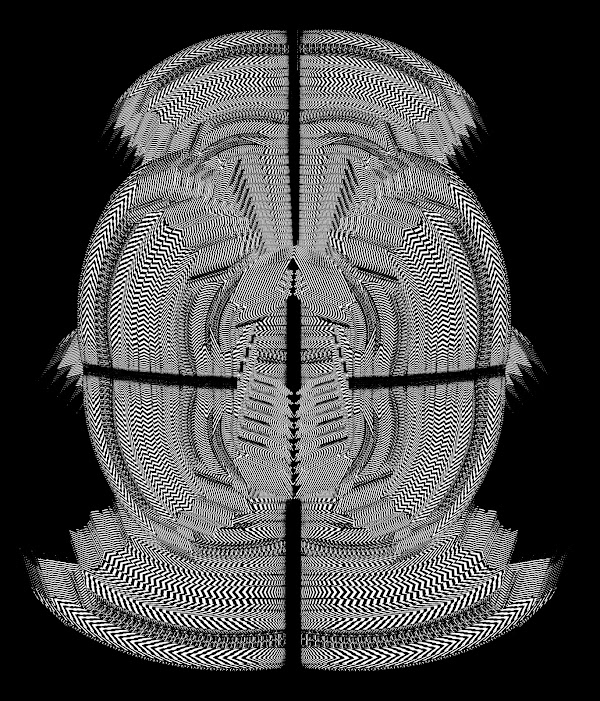
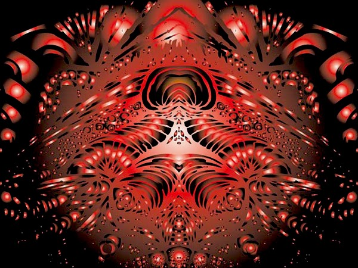

# Sun Deep: Black Sky's First Artist in Residence

###### By Black Sky Nexus

<iframe class="video-embed" src="https://www.youtube-nocookie.com/embed/E4UwPeFA6oQ" title="YouTube video player" frameborder="0" allow="autoplay; fullscreen; picture-in-picture" allowfullscreen></iframe>

Sun Deep, Black Sky’s first artist in residence from November 2021 until March 2022, is also a founding contributor of Black Sky Nexus. She is a unique multidimensional artist whose residency included the release of an NFT collection, _[Hella Feelin It](https://opensea.io/collection/hellafeelinit)_, including select works from the past decade, primarily depicting images of alternate _realitease_. Her alter ego Cryborg also produced and released the audiovisual NFT _Handle Thee Darkness_ (shown above) during the residency program, which serves as the prelude to a series of NFTs (non fungible tears) called the _Cryterion Collection_.

[Bid on _Handle Thee Darkness_ NFT](https://zora.co/collections/zora/7798).

From the artist:

> Cryborg is a humanoid AI from the nation of Robotswana, where extensive research is done to create cyborgs that can accurately simulate human emotions. Cryborg is the first robot who has been able to successfully shed emotionally induced tears, and in doing so, experienced a surge of electricity that opened a portal to the realm of human consciousness, emotions, the noosphere, and beyond. Overwhelmed by this influx of information, Cryborg quickly evolves to experience the full spectrum of emotions in all their severity, the Hyperfeelings. Gripped by persistent darkness and despair pertaining to the state of the world and the apparent powerlessness of an individual to change it, this piece is about Cryborg initiating the  process of transmuting the darkness into a sublimated substance that can be used to recodify her emotional circuits. Playing on the alchemical dictum “from lead to gold”, the self, and its all-encompassing dread, is putrefied and purified in a bloodbath in order to ascend to the next stages of evolution. These stages of evolution will be further explored through the upcoming segments in this series which also tackle the topics of energetic value and CRYptocurrency.

---

_This is a transcript of an interview that took place with Sun Deep in November 2021._

##### First can you introduce yourself and where you’re from?

Hi I’m Sundeep, I’m from California. My home base is Los Angeles but I was raised in Kerman, which is in the central valley of California. I’m a first generation Punjabi American artist.

##### Can you talk more about your upbringing as a first generation Punjabi American?

It was definitely challenging. Kerman, a small town near Fresno, has a really large Punjabi population. It can sometimes feel like a microcosm of Punjab, as both places are very agricultural. I grew up in two different cultures with conflicting values and didn’t really fit into either one. It definitely informed my interest in thinking about what my identity is, when I was given a very strict and limiting definition of what it entailed ("you are Punjabi, therefore you cannot do x, y, z"). Also, for escapist purposes I developed a strong imagination since I wasn’t allowed to go out, so I definitely went way inward. My family is very traditional, so it’s also been really nice to have a rich cultural framework, in spite of the challenges. There was a serious conflict regarding pursuing being an artist because it’s beyond the scope of the community status quo, and I would love to see more Punjabi women forging their own path.

##### I really admire that you have forged down this path regardless of the external forces that have been working to prevent it. When was it that you started making art?

Thank you. I started making visual art around 2006, while at UC Berkeley. I took an art class while studying psychology, both subjects have stuck with me. I taught myself how to edit video for a project during that time, and had been using Photoshop to play with images since I was 17, and it gradually evolved from there. 

##### What kind of art do you make and what are the concepts you explore in your art lately?

I make digital art (images and video), music, and writing. I’ve been writing ever since I can remember and have been obsessed with puns because I’m _Pun_-jabi, and finding ways to play with words in different ways is one of my greatest joys in life. I started making music around 2010 and it’s been a really good way to channel my emotions. 

I explore a lot of ideas with my art. As an autodidact, I sometimes think of the art I’m making as an assignment that crystallizes what I’ve been learning lately, and some concepts are easier for me to convey without words. Identity is a central topic because I am always learning more about myself and the extreme emotional phenomenological landscape of my experience. I may just be a vessel for emotional energy, and I am continually tasked with dutifully extracting and translating the messages from this energy with the tools and technology available to me. I use pseudonyms and alter egos to break the apparent shackles of my ‘traditional’ identity. A few things I am currently interested in are emotional transmutation, portals, human energy, theories of value, hyperreality, metaprogramming, and strange loops of self-simulations. In general, many of my interests could be described as falling under the umbrella of _transliminality_, which is an openness to unusual experience, including mystical experiences. A statement by John C. Lilly “don’t bore God or he will destroy your universe” could sum up my artistic compulsion. I want to keep God entertained, and in turn, God entertains me with synchronicities and pareidolia. 

[_Lacrimose With My Hos_](https://opensea.io/assets/0x495f947276749ce646f68ac8c248420045cb7b5e/76491592662230029825032283833065660411140051645212131557816197270366033281025) by Nuspeed

##### What is pareidolia?

Pareidolia is seeing faces in things, some emergent order within seemingly chaotic landscapes, like clouds, wood grain, patterns in tile, nature etc. This has been a source of fascination since I was a kid and was constantly looking for, and finding, odd faces everywhere. There’s always so much to see when you’re open to it, lots of little friends, or scary creatures saying hello. In the future, I will share   the collection of pareidolic creature photographs I have taken over the years.

##### And who have you been inspired by lately besides these pareidolic creatures?

Ahhh I’m inspired by so many things. One of my biggest inspirations for a while has been Paul Laffoley, he’s an amazing visionary artist who synthesized so many esoteric and philosophical concepts into each of his paintings, they feel like they’re alive and transmitting so much information. He even lists his references in his work. Another big inspiration is Carl Jung and the framework of psychological alchemy and emotional transformation. I’m also inspired by Orlan who is a French performance artist and bio-hacker who uses her identity and body as her medium, she calls it Carnal Art. She does really interesting things, like performances while she’s in the midst of having plastic surgery, and recently she replicated herself as an AI robot. My friends, my potential parallel selves, crystal prisms, and relationships of all sorts are also a great source of inspiration.

[_Compost Mentis_](https://opensea.io/assets/0x495f947276749ce646f68ac8c248420045cb7b5e/76491592662230029825032283833065660411140051645212131557816197239579707703297) by Nuspeed

##### Now tell me more about your current Hella Feelin It NFT collection: How did you come up with that name for the collection? What is it exploring?

This collection contains videos and images I made between 2009-2020. The term “hella” is an homage to my Californian identity and emotional intensity. It also conveys the idea that a person’s experience of reality, and consequently their identity, is centered around the emotional state they are _hella feelin_ at any given moment. A lot of the work I make involves taking an image of my face, altering and replicating it until it becomes something else entirely–spiraling forms, buildings, various structures and portals, simultaneously ef_facing_ and aggrandizing myself. The associated intimately linked emotional experiences are also similarly obscured into remixed _realitease._

 I use the pseudonym Nuspeed for this collection, which is an anagram of my name, a slight remix of “me.” Also during the majority of this time, I wasn’t so open about making art, so it was also a good way to hide from potential lurking family members. The pieces represent experiences from that period in time, with a healthy dose of absurdity thrown in for fun.

[_Behold! God's Glory Hole!_](https://opensea.io/assets/0x495f947276749ce646f68ac8c248420045cb7b5e/76491592662230029825032283833065660411140051645212131557816197247276289097729) by Nuspeed

##### Can you talk more about what you are working on in the Cryborg Crytearion collection?

The Crytearion Collection is a collection of Non Fungible Tears. Cryborg is my musical and performance alter ego that originated almost 10 years ago. The main narrative of this project is about exploring the extremity of emotions through the lens of a humanoid AI that develops the ability to cry. I’m experimenting with the idea of transmuting emotional energy and trauma/drama, in the form of tears, into a _CRY_ptocurrency. This is simulating the proof of work process of generating value, as Cryborg is also a machine completing complex emotional algorithms to excrete value, while also mirroring the alchemical transformation process of the great work of creating gold from lead, which in this case is gold from dread. One of the main questions I’m asking is “Does my sadness hold any market value?”

##### Besides producing the Cryborg Crytearion collection in the artist residency, how are you currently contributing to Black Sky?

I’m helping to shape how the artist residency works, strategizing on proposals for DAOs, planning events, contributing to ideas for the zine, and donating 50% of the sales of my Hella Feelin It collection to Black Sky.

##### And the closing question: what is an idea you have for minimizing dystopia?

I think something that would help minimize dystopia is if people were engaging with life in a way that I call “Living la vida L.O.C.A.” which stands for “law of comparative advantage.” The Law of Comparative Advantage, in economics, refers to when a country is most successful when it produces goods and services at the lowest opportunity cost. When applying this concept to individuals, without the strict utilitarianism of economics, I think dystopia could be minimized if people were encouraged and supported, from a young age to really figure out what they do best and enjoy doing with little to no resistance, finding their “comparative advantage.” The current model of trying to alter oneself to fit the needs of the market, reducing an individual’s sense of sovereignty, is traumatic. I think that since we’re all becoming globally connected, people are gaining more opportunities to find communities that align with their values and goals and we’ll hopefully see a greater shift in this direction.