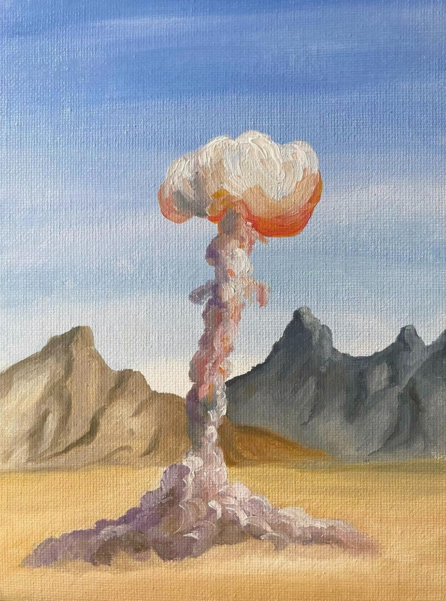
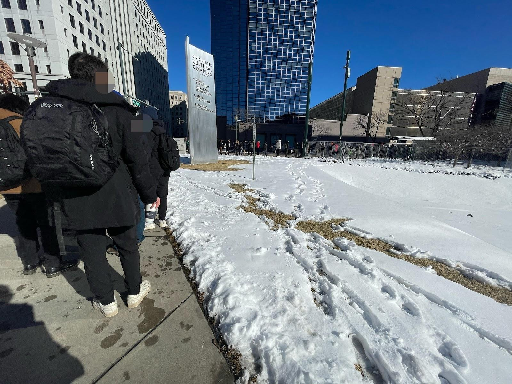
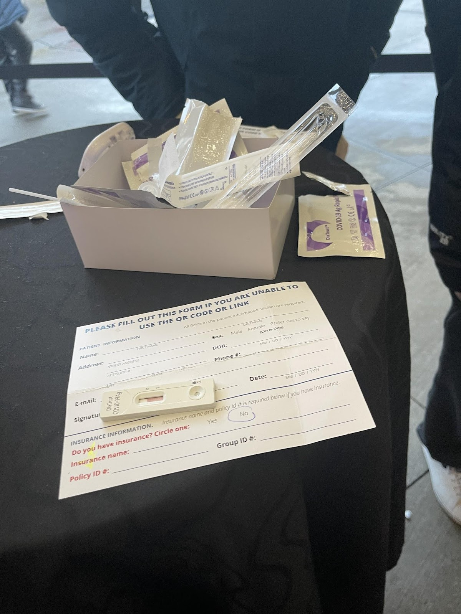

import ImgUp from '@site/static/img/dec_up.svg';
import ImgDown from '@site/static/img/dec_down.svg';
import Header from '@site/docs/img/ethdenver-cover.jpeg';

# That One Time I Attended ETHDenver Not Knowing What a Blockchain is...
...and Left With a Newfound Respect for the Crypto Community

###### By E. Øss
<ImgUp className="img-up" />

<ImgDown className="img-down" />

###### Part 1
Denver, Feb 2022 — I’m attending ETHDenver for the first time and I don’t even know what a blockchain is. By the time I leave this conference, I will have a vague but growing understanding of what a blockchain is as well as a positive case of COVID-19 I most definitely obtain at a mansion rager with other conference attendees. So bear with me, and enjoy the ride (or don’t, and don’t; it’s up to you). 

For some context: I’ve spent the last two years living alone in the high desert during the pandemic. My daily life is simple: I remotely operate a chatbot that schedules appointments part time and do remote freelance work another part of the time. I’m also a fiction writer and a painter for the other parts of the time. 

See paintings below:

Essentially the core of what I do is multiple side hustles out of my studio apartment where I live with my cat Dennis who is abnormally small and especially whiney (I do love him).

My only pre-conference experiences with crypto counter culture are 1) my older brother berating me over the last decade that I “should really invest in crypto” when he has yet to invest himself and 2) I’ve recently done some freelance editing work for an emerging DAO and was paid in crypto for the first time, in DAI, a stable coin, the money I immediately transferred into US dollars because I’m still too afraid to ride the waves. 

You see, I’m a long term starving artist. I don’t have health insurance. I haven’t been to a dentist in years (thanks sensodyne, flossing, oil pulling, and fervent prayer my teeth don’t break). I’m staunch about staying out of debt and living frugally. And look, I’m not complaining. For a literary writer and painter, this is just one example of what it looks like to build a career: you spend a decade trying to master your artform while slowly and intermittently passing through important, narrow gates. Even now, I’m still a book publication away from being close to a somebody. I have some impressive credentials and a lot of potential. The story collection I’m currently revising with my agent will be pitched to publishing houses for around $50k tops, probably less. What publishing houses really want is novels that can be adapted into films, not collections full of neurotic characters with obsessions, addictions, repressed emotions, and compulsions to, say, set themselves on fucking fire (if you grew up in the American Midwest like I did, you might feel me on that). 

So here I am attending ETHDenver as a person who has a cautious, healthy respect for not having much money and never knowing if/when I will. At this conference people will be talking a lot about currency, what people do with their currency, how currency goes up and down in value, the investment of currency, how people put a lot of currency into NFTs, that there are these huge crypto-based financial entities called DAOs that don’t have CEOs and instead operate around the votes of members who have invested, you guessed it: currency. 

During the week of the conference I will hear the following words/terms over and over: “crypto,” “cryptocurrency,” “blockchain” “DAOs,” “metaverse,” “NFTs.” 

For an outsider, it’s a lot to take in, a whole subculture that rests on at least understanding what blockchain technology is; truly, if you don’t understand blockchain, nothing else will make sense. Blockchain is the foundation upon which this whole counter culture has been built and on which it continues to evolve and grow. It is the origin of crypto controversy (some blockchains use A LOT of electricity to operate) as well as the passageway to providing greater financial freedom and potentially privacy. So, as with most things that are high stakes for humanity: a double edged sword. 

So what is blockchain? Blockchain is the use of technology and mathematics to create an ever-evolving ledger of information that cannot be altered or fudged. It works as an effective ledger of currency because of its ability to safely store accurate, cumulative information about transaction histories as the transactions continue to occur in real time. The blockchain also records how many new crypto coins are mined as the blockchain advances. The main point is: it’s an organized way to invest, store, and withdraw currency. 

The secure and self-sustaining aspects of blockchain technology are what allow it to act as a foundational means of putting an entire counterculture into motion under a highly organized and trustworthy system for evolving new forms of currency and trading as well as all new types of business models and ways of buying and selling art and other digital artifacts as an investment.  

Mind you, I didn’t yet know all of this when I took my place in line outside The Art Hotel in downtown Denver on the Thursday of the conference. My goal being here was to come with an open mind, to keenly observe people at the conference and events to get a better sense of what this community is all about. Hundreds of other ETHDenver attendees were already waiting in the line to take, and hopefully pass, a COVID rapid test to obtain their wristbands and basic entry into the event itself. The temperature was right around freezing and the line was estimated to take about three hours to get through. 

The other people I was attending the conference with had already obtained their wristbands, so everyone in line around me was a stranger. After about twenty minutes of standing around in the cold, people finally began chatting to the new faces around them. I met a senior in undergrad at Washington University in St. Louis who was majoring in engineering, as well as a few seniors from Harvard, and then another freelance writer in his early thirties who had only gotten into crypto in the last couple of years. “There’s just a lot of money in it,” he said, insofar as: he could make a good living writing about trends in crypto. The undergraduate seniors I befriended in line reminded me of previous students of mine when I taught undergrad, and also what I cherish about people who are at the very start of their academic or professional careers: passion, excitement, and optimism to bring innovation to their fields. 

A negative claim some have made about crypto is that it is just another institution of old cronies at the top who invest and get richer and richer while less wealthy investors miss the really big booms of rising values in various currencies. The problem with this argument is that the crypto community continually evolves. More people are grafted into the counterculture, and with them, come new ideas or questions about what blockchain can do in tandem with the changing needs of society. The natural pitfall of a trading market in which the rich keep getting richer is bound to happen, but in crypto, each new generational wave of community members can extend what is already possible with cryptocurrency into new structures that can benefit humanity and provide financial freedom. Investing now is not a dead end. Investing now just means you’re entering the community with a cohort of others who, depending on your individual and collective participation, can shape the community as it moves forward. For instance, the recent popularity of buying and selling NFTs as a form of investment has been a way waves of newcomers from over the last decade, who, for instance, missed out investing in Bitcoin in its pre-boom era, could get involved in one new way crypto attracts newcomers who could grow their wealth in a movement with considerable momentum behind it. 

Once I reached the front of the line, the sun was going down. My fellows and I were counted into a group of twelve and then ushered around a folding table where we received our COVID tests and instructions on how to administer them: stick the swab up one nostril, swirl for fifteen seconds, remove the booger swab and swirl it in the little bottle of liquid, remove the swab and pour the liquid onto the rapid test. Then wait, ten minutes. 

We were all frozen solid at this point, joking: “Well, if we don’t have COVID now, we’re certainly going to have it after standing around this many hours outside during winter.” One person in my rapid test group joked: “What if we found out there was a rule that if one of us was COVID positive, the whole group could not enter the conference?” Spoiler alert: we all tested negative for COVID. 

We were all finally given leave to enter The Art Hotel lobby to obtain our wristbands for the conference. The group of us who had been standing together sort of just shrugged and went inside. Once inside, we scattered—and just like that, our developed comradery as people who waited next to one another in a very long line disassembled back into individualism, attending the conference to our own ends. 

After waiting three hours in the freezing cold to pass a COVID rapid test to obtain my wrist band and contributor’s badge, I was all in for the conference and its extracurriculars. Like, forget that my usual bedtime in the last three years has been 8pm with a wake up time of 5am, or that I’d spent the last two years of a pandemic wearing a mask in public spaces. I was committed to wrecking my rigid, safe lifestyle by going maskless into the conference, and attending all the conference parties/events I could, staying out late and sleeping in like a version of myself with whom I had not been familiar in nearly a decade. I think maybe that’s the effect the crypto community can have on people when they’re open to embracing it: the parts of you that have weathered into a lifestyle of stable, safe habits, with less risk, less edge, reawaken; when you’re on the fence about something, you’re more prone to saying “fuck it” and doing the more rebellious, out of character thing. 

Something I was sure of going into the conference is that you cannot enter these spaces and be impervious to change, or have preconceived ideas of the crypto community, if you’re going to go from an outsider to a person actually capable of understanding, even in part, what this community is about. 

In the coming days of the conference I will attend parties, collect merch, talk to strangers, reflect on new ideas, look at art, listen to amazing music, stay up late, and get Omicron, and I won’t regret any of it. 

###### Part 2
###### (coming soon)