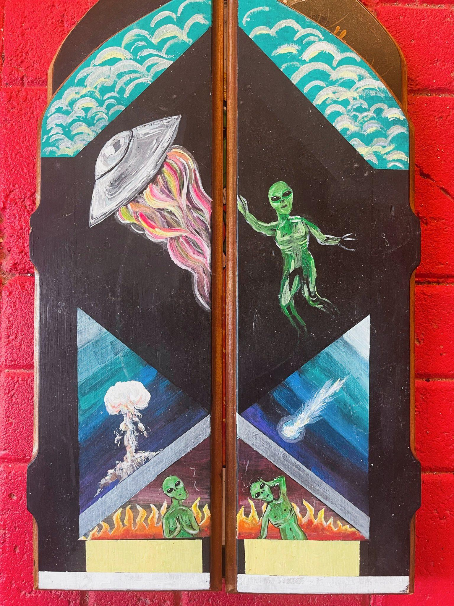

import ImgUp from '@site/static/img/dec_up.svg';
import ImgDown from '@site/static/img/dec_down.svg';
import Header from '@site/docs/img/ethdenver-cover.jpeg';
import Meme from '@site/docs/img/meme.png';
import Painting from '@site/docs/img/painting.png';
import Test from '@site/docs/img/covid-test.png';
import Blimp from '@site/docs/img/blimp.gif';
import Art1 from '@site/docs/img/art.gif';
import Art2 from '@site/docs/img/denver-art.png';
import Mansion1 from '@site/docs/img/classic-painting.png';
import Mansion2 from '@site/docs/img/projections.gif';
import Mansion3 from '@site/docs/img/dancing.gif';

# That One Time I Attended ETHDenver Not Knowing What a Blockchain is...
...and Left With a Newfound Respect for the Crypto Community

###### By E. Øss
<ImgUp className="img-up" />

<ImgDown className="img-down" />

###### Part 1
Denver, Feb 2022 — I show up to ETHDenver for the first time not even knowing what a blockchain is. By the time I leave this conference, I will have a vague but growing understanding of blockchain technology and crypto counterculture, as well as a positive case of COVID-19 I most definitely obtain at a mansion rager with other conference attendees. So bear with me, and enjoy the ride (or don’t, and don’t; it’s up to you).

For some context: I’ve spent the last two years living alone in the high desert during the COVID-19 pandemic. My daily life is simple: I remotely operate a chatbot that schedules appointments part time and do remote freelance work another part of the time. I’m also a fiction writer and a painter for the other parts of the time. 

See painting below:

Essentially the core of what I do is multiple side hustles out of my studio apartment where I live with my cat Dennis who is abnormally small and especially whiney (I do love him).

My only pre-conference experiences with crypto are 1) my older brother berating me over the last decade that I “should really invest in crypto” when he has yet to invest himself and 2) I’ve recently done some freelance editing work for an emerging DAO and was paid in crypto for the first time, in DAI, a stable coin, the money I immediately transferred into US dollars because I’m still too afraid to ride the waves. 

You see, I’m a long term starving artist. I don’t have health insurance and I haven’t been to a dentist in years (thanks sensodyne, flossing, oil pulling, and fervent prayer my teeth don’t break). I’m staunch about staying out of debt and living frugally. And look, I’m not complaining. For a painter and literary writer, this is just one example of what it looks like to build a career: you spend a decade trying to master your artform while slowly and intermittently passing through important, narrow gates. Even now, I’m still a book publication away from being close to hirable for a tenure track teaching gig at a university. What I have as of now is some impressive credentials and publications and a lot of potential. My first book is a story collection I’m currently revising with my agent, which will be pitched to publishing houses for around $50k tops, probably less. What publishing houses really want is novels that can be adapted into films, not collections full of neurotic characters with obsessions, addictions, repressed emotions, and compulsions to, say, set themselves on fucking fire (if you grew up in the American Midwest like I did, you might feel me on that last one). 
 

So here I am attending ETHDenver as a person who has a cautious, healthy respect for not having much money and never knowing if/when I will have a good amount coming in. At this conference people will be talking a lot about currency: what people do with their currency, how currency goes up and down in value, the investment of currency, how people put a lot of currency into NFTs, the future of society as funded by a counterculture’s currency, and that there are these huge crypto-based financial entities called DAOs that don’t have CEOs and instead operate around the votes of members who have invested, you guessed it: currency. 

During the week of the conference I will hear the following words/terms over and over: “crypto,” “cryptocurrency,” “blockchain” “DAOs,” “metaverse,” “NFTs.” 

For an outsider, it’s a lot to take in, a whole subculture that rests on at least understanding what blockchain technology is (truly, if you don’t understand blockchain, nothing else will make sense). Blockchain is the foundation upon which this whole counterculture has been built and on which it continues to evolve and grow. It is the origin of crypto controversy (some blockchains use A LOT of electricity to operate) as well as the passageway to providing greater financial freedom and potentially greater social and financial privacy and agency. So, as with most things that are high stakes for humanity: a double edged sword. 

So what is blockchain? Blockchain is the use of technology and mathematics to create an ever-evolving ledger of information that cannot be altered or fudged. It works as an effective ledger of currency because of its ability to store accurate, cumulative information about transaction histories as the transactions continue to occur in real time. The blockchain also records how many new crypto coins are created as the blockchain advances. The main point is: it’s an organized way to invest, store, and withdraw currency, and is the foundation of crypto as a fully functioning, alternative marketplace. 

It can be easy for a newcomer like me to initially get lost in thinking of crypto as a form of monetary investment because it is so often referenced in popular culture as a way to grow wealth. However, it’s important to look at crypto through the scope of why it was created in the first place, why there were people out there looking to form an alternate marketplace. 

Money and wealth are each essential in the formation or operation of any sort of organization or venture that could aid in the progress of society. Funding is essential for individuals to gain leverage on, and freedom from, monopolizing institutions and governments they don’t deem trustworthy. It’s not just money for money’s sake. Funding is essential to advancement and accomplishment, how we complete projects, how we form collectives, as well as how we reorient who has financial sway or what advances in society will get funding and priority. 

Mind you, I didn’t yet see things through this scope as I took my place in line outside The Art Hotel in downtown Denver on the Thursday of the conference. My goal in attending the conference was to come with an open mind, to keenly observe people at the conference and to attend events and get a better sense of what this community is all about. 

Hundreds of other ETHDenver attendees were already waiting ahead of me in line to take a COVID rapid test, which we all had to pass to obtain our wristbands and basic entry into the event itself. The temperature outside was right around freezing, and the line was estimated to take about three hours to get through. 

The other people I was attending the conference with had already gone through the process of COVID testing and getting their wristbands, so everyone in line around me was a stranger. After about twenty minutes of standing around in the cold, people finally began chatting to the new faces around them. I met an undergraduate senior at Washington University in St. Louis who was majoring in engineering, as well as a few seniors from Harvard, and then another freelance writer in his early thirties who had only gotten into crypto in the last couple of years. “There’s just a lot of money in it,” he said, insofar as: he could make a good living writing about trends in crypto. The undergraduate seniors I befriended in line reminded me of previous students of mine from when I taught undergrad, and they also reminded me of what I cherish about people who are at the very start of their academic or professional careers: passion, excitement, and optimism to bring innovation to their fields. 

One negative claim some have made about crypto is that it just replicates the old market system and accounts for another institution of cronies at the top, the rich getting richer while less wealthy investors miss the really big booms of rising values in various currencies. The problem with this argument is that the crypto community continually evolves and works in tandem with crypto being a support for funding and progressing new ideals for society. It’s what I said previously: this whole movement isn’t just about wealth, but about progress through greater financial freedom and greater privacy and autonomy. As more people are grafted into crypto counterculture, these individuals bring new ideas or questions about what a freer market and blockchain can do in tandem with the changing needs of our society. So while a natural pitfall of any trading market is that the rich keep getting richer, in crypto, each new generational wave of community members can extend what is already possible with cryptocurrency into new structures that can benefit humanity, that challenge the status quo, and that provide new financial freedoms to citizens alternative to what their governments provide. So investing in crypto now is not a dead end. Investing now means you’re entering the community with a cohort of others, who, depending on individual and collective participation, can shape the community as it moves forward. 

For instance, the recent popularity of people buying and selling art NFTs doesn’t just come down to a form of investment for the buyer, nor mere payment for the seller. 

NFT stands for non-fungible token and is the storage of data in a particular blockchain to account for the ownership of that data, which can be bought and sold as a record in the blockchain’s evolving ledger. Art NFTs have now taken over in the broader art world as the primary means of collecting and selling digital art and of paying digital artists for original works. The collectible aspect of NFT image data has even led to the phenomenon of buying and selling the original rights to famous internet memes, bringing about conversations as to whether meme-making is a legitimate form of art making as well as the underlying usefulness of memes as a form of expression, redefining whether memes can now take part in the ever-debated question: “What is art?”

I want to pivot for a moment and examine just what role artists have in society, and why artists are essential to crypto as a platform and tool for social and economical movements and change. 

Artists are the people tasked with helping us 1) appreciate or examine beauty and aesthetics and 2) helping humanity define and redefine our personal understandings of essential self/other relations, of universal situations, human and environmental needs, and of baffling phenomena. 

What are memes exactly? Memes pair imagery with language to fill important voids in meaning-making, ultimately to create the opportunity for narrative integration, i.e. the ability to make others feel seen and heard in illuminating ways by drawing attention to universal experiences or scenarios that are being closely examined through an intentional combination of imagery and words.

We all likely have favorite memes or ones we’ve encountered during particularly relevant times in our lives. The following meme is one of my favorites:

In this meme we find the interplay of different emotional states creating cognitive dissonance, ultimately speaking on the value of life and the potential transience of emotions we perceive as negative or painful. Depression can make a person question the purpose of life or the will to go on, while anxiety is the emotion through which we worry over our present or future circumstances, and to worry over present and future circumstances implies a form of investment in living that is counter to depression’s lack of incentive to go on. How can we have lost the will to go on when we still have the ability to worry about the future? 

So the interplay of concepts, images, and words that make up a digital meme make for one of the most concise ways of sharing empathy and understanding among whole swaths of strangers all around the world through the sharing of memes on various social platforms. Memes typically don’t have any copyrights and are memetic in that they spread rapidly on online platforms as a largely priceless sharing of value through humor and sense making. Through memes, we also see common characters that represent human archetypes. 

Some meme images l have been used again and again to examine l both human character and situational archetypes, for instance, Bad Luck Brian, which is a school photo of a red headed high school boy making a doofus looking smile, his teeth accompanied by an obvious set of braces; meanwhile, he is wearing a collared shirt and a plaid sweater vest. The image is the perfect visual archetype of a well intentioned nerd who would have terrible luck in areas like romance, achieving important milestones, getting away with mischief, and the like. Most of the universally used meme images were ones that went viral beyond the intentions of the individual in the photograph. And now, many unwitting individuals whose photos have been used as famous meme templates have been able to go on and sell the rights to the original images of themselves in the form of NFTs. 

By turning these images into NFTs that can sell for several thousand dollars, crypto is making clear we place value on what could be considered an emerging artform or channel of expression, one that has a major public stage, and we are compensating the individuals who provide us with these free, widely circulated images and who have enabled us to engage conversations over various human experiences and archetypes. The assignment of actual monetary value to memes has only been possible through crypto and the rise of NFTs. 

In fact, NFTs were one of the major talking points at ETHDenver, and many NFT artists were in attendance. 

And back at The Art Hotel, the sun was going down by the time my new crypto buddies and I reached the front of the line. By then we were all shivering, many of us wearing uniform merch beanies someone was handing out to everyone in line. My fellows and I were counted into a group of twelve and then ushered around a folding table where we received our COVID rapid test kits and instructions on how to administer them: stick the swab up one nostril, swirl for fifteen seconds, remove the booger swab and swirl it in the little bottle of liquid, remove the swab and pour the liquid onto the rapid test. Then wait, ten minutes. 

We were all saying: “Well, if we don’t have COVID now, we’re certainly going to have it after standing around this many hours outside during winter.” One person in my rapid test group joked: “What if we found out there was a rule that if one of us was COVID positive, the whole group could not enter the conference?” 

Spoiler alert: we all tested negative for COVID, at which point we were all finally given leave to enter The Art Hotel lobby to obtain our wristbands for the conference. The group of us who had been standing together for hours sort of just shrugged and went inside, and once inside, we scattered—just like that, our developed comradery as people who waited next to one another in a very long line disassembled back into individualism, attending the conference to our own ends. 

What I can say is that after waiting three hours in the freezing cold to pass a COVID rapid test to get my wristband and contributor’s badge, I was dedicated to attending the conference and its extracurriculars. You can’t give that many hours of your life away to the low grade torture of your limbs going numb from cold and not make full use of the sacrifice. Like, forget that my usual bedtime in the last three years has been 8pm with a wake up time of 5am, or that I’d spent the last two years of a pandemic wearing a mask in public spaces. I was committed to wrecking my rigid, safe lifestyle by going maskless into the conference, attending conference parties and events, staying out late and sleeping in like a version of myself with whom I had not been familiar in nearly a decade. I think maybe that’s the effect the crypto community can have on people when they’re open to embracing it: the parts of you that have weathered into a lifestyle of stable, safe habits, with less risk, less edge, reawaken. If you’re on the fence about something, you’re more prone to saying “fuck it” and doing the more rebellious, out of character thing. 

Something I was sure of going into the conference is that you cannot enter these spaces and be impervious to change, or have preconceived ideas of the crypto community if you’re going to go from being an outsider to a person actually capable of understanding, even in part, what this community is about. 

___

My first night having my wristband and access to official conference activities I attended the Hydra opening event at Wings Over The Rockies Air and Aviation Museum. The museum was converted into an event space with a DJ and dance floor in the center of the hangar and vendor stations selling drinks and snacks on the perimeter. The whole museum was open for guests to explore, including a space with multiple full ass military airplanes on display as well as a flying blimp over the dance floor that was dropping merch and NFTs. (An interesting question my fellow Black Sky steward mentioned is: “Why are crypto people having functions at venues with military artifacts?” I think that’s a great question to just throw out there and think about. What does that choice say exactly about the values of the individuals putting together ETHDenver?). 

The people I was attending the conference with were going to meet me at the event but ended up finding a dance party in downtown Denver where a couple of them could play DJ sets, so they stayed put. This left me to explore the museum by myself and eventually muster up the courage to talk to strangers. 

I had made my way to the dance floor and was looking up at the merch-dropping blimp when a man came up to me and showed me a piece of paper that had a scan code on it. “It’s an NFT,” he said. “It came from the blimp!”
“What’s the NFT it gave you?” I asked.

I momentarily considered chasing the blimp around the hanger until it dropped something but I didn’t want to expose myself as a party novelty thirst trap. I actually noticed this was an inclination I would have at the conference, one of awe at anything campy or free relating to crypto (such as the expansive merch booths).

The man I spoke with who had gotten the NFT from the blimp was originally from China and was presently working as an engineer and living in San Francisco. He and I joked a lot about my not knowing much about crypto and my being a starving artist in art fields that aren’t even close to the art world in the crypto community. 

“So what are you doing at the conference then?” he asked.
“Just learning, observing, hearing what people have to say.”

My primary reason for attending the conference was that I had begun doing freelance work for Black Sky in its very beginning phases as an emerging DAO concerned with minimizing dystopia and maximizing harmony in areas such as ending labor, protecting the environment and resources, and eventually moving towards a decentralized space exploration program (and so much more). Prior to my work with Black Sky, I had never known much about crypto. My understanding of crypto was more through the hearsay of mainstream discourse, and more to do with the capitalist libertarian aspects of Bitcoin. I was not yet versed in the other emerging currencies and the people getting involved in those currencies as creating movements associated with those currencies. For instance, Ethereum as the primary currency for buying and selling NFTs and one that also draws in a crowd interested in Decentralized Autonomous Organizations, which come together with collective agendas, group participation, and financial resources. 

What I could say by the time I attended the conference, and had been working on launching Black Sky, was that, at this present juncture of the Information Age, people have more access than ever before to the knowledge that we presently live in a true dystopia: a global pandemic, unaffordable housing, a minimum wage rate that can’t rise as quickly as inflation, wars, resource scarcity and unaffordable rates for resources, unpayable debts, a housing market in which millions cannot begin to afford purchasing their own property, a worse surveillance state than the one George Orwell imagined in _1984_, oligarchic politicians who are so bipartisan, and so blatantly self-motivated, it doesn’t even feel real how these people could be allowed to hold office, but they do, and they hold long terms in which they use their leverage to side with the corporations to whom they invest and from whom they make a great deal of personal assets.

Anybody sane in this world just wants a life they can afford without chronic stress over resources or housing, without working so many hours they have no ability to enjoy hobbies, interests, or new ventures they feel passionately about. In America, the lower end of the middle class has been reduced to a cohort of millions who now have too much in assets to qualify for Medicaid but who can’t afford the monthly rates to purchase their own private health insurance — and yet, the very small amount some have in assets that prevent them from obtaining Medicaid wouldn’t even begin to cover most ER bills for a broken bone. It’s a nightmare of hitting glass ceilings facilitated by the government. Meanwhile, the federal reserve continues to churns out more and more “funny money” for which the US government has no tangible gold or resources to back up. For decades now, the United States of America has been little more than a giant pyramid scheme.

Maybe cryptocurrency as we know it today can’t beTHE answer to these problems, as crypto is still a hyper-capitalist structure in most applications, but the beliefs and sentiments of crypto counterculture, and the projects taken on by this cohort, provide forms of experimentation and movements that complicate the major dystopian quandaries in illuminating and proactive ways. Crypto is not a capitalistic market alone but is comprised of people who, instead of trying to function just like original investment markets, or lobbying with the oligarchs of these investment markets, are merely forging ahead without them, and in spite of them, by, in many ways, going around them.

Crypto also acts as evidence that huge, alternative systems can successfully function and grow and that the everyday citizen can now take part in working around the seemingly unsolvable problem of national and global governmental control by participating in resource-backed, adjacent power structures. It’s just that crypto is still the Wild West, still susceptible to oligarchy or the monopolization of resources or pyramid schemes that make the rich even richer, with those who have become very rich through crypto exposed to the allure of using newfound wealth to grow even more wealth rather than using acquired wealth to be of wide scale benefit to society. A major potential pitfall of crypto: personal greed. 

But it still stands to reason that a major societal reboot, a do-over, a chance to take our cumulative knowledge of human history and forge ahead with an opportunity for punctuated national and global changes, can occur when alternate members of a society obtain wealth, and therefore wield power, especially when people combine their wealth and power. Power, in and of itself, isn’t good or bad. Power is simply the ability to direct momentum in one direction or another—it’s the directions, and their consequences, that lead us to deem something as underlyingly good or bad as we hold up said consequences to our personal codes of morality. 

This seems to be the major revelation I keep returning to with crypto: it can serve to live out old and corrupt power structures OR it can be the wrench thrown into the mix that creates opportunity for groups staging social and economical uprisings with substantial resources backing them. (Please check out Stellar Magnet’s [thought provoking article on TAOs](../../zine/00000000/transformative-autonomous-organizations), Transformative Autonomous Organizations, as an example of the possibilities of using crypto to redistribute power into a system that works for the people by being an avenue for “the people” to be equal and involved decision-makers of a structure that can evolve to fit the needs of the times and the pressures facing humanity).

ETHDenver was an example of the many people contributing to the evolution of cryptocurrency not just as a personal investment strategy but as a tool for other advancements. 

The ETHDenver conference itself was held in the Sports Castle, a six floor rectangular building on a lively street in downtown Denver. One major complaint with the conference this year was that the amount of people who ended up attending far exceeded the Sports Castle’s amount of occupancy space (not a terrible quandary given it implies the amount of people excited about crypto has grown beyond previously predicted numbers). Since the Sports Castle could only take in so many occupants at once, there was a very long line outside where individuals waited for enough people to leave the venue for that number of people in line to then be granted entry. This means attendees not only waited hours to pass a COVID rapid test to obtain their wrist bands, but that wrist bands were just the next step to having to wait in another long line to get inside the venue itself. Unfortunately many who attended missed out on the talks or events they wanted to attend because they were unable to enter the main venue in time. 

Those who had contributor badges, in addition to wrist bands, were given VIP entry into the Sports Castle, allowing some to skip the long line and go right inside. My ticket to the conference luckily included a contributor’s badge, so I was able to enter right away. That said, I didn’t want to abuse my contributor’s badge by taking up occupancy inside the conference when many others desperately wanted to attend but had to wait for hours outside. My goal was to get in, thoroughly explore, collect free merch, talk to people, and then get out, have at least one solid go of the event space itself and then let others attend the forums and meetups they came to experience. 

I went into the Sports Castle on Friday in the afternoon. There was definitely an Alice in Wonderland scale effect once you made your way inside. The building looks smaller than it is from the street but manages to have so many floors, nooks, and crannies that it was at once cramped in the more central rooms, where talks were held, but endless and explorable in the smaller rooms on the fringes. These smaller rooms mostly displayed art and had DJs off to the sides, providing ample space in smaller rooms to move around or even get a moment of alone time accompanied with some music under dimmer, neon or colored lighting that was a pleasing contrast to the bright overhead lights in the more central, packed rooms of the venue. 

Since the conference was my first major social event after COVID-19 had turned everyone into shut-ins, it was the first time I was 1) in a large event space in a crowd and 2) surrounded by people who weren’t wearing masks. I found myself easily overwhelmed by the amount of people around me and was also oddly elated to see so many faces. I kept thinking: “People are so beautiful. Everyone is so attractive. My God, I love faces so much. Look at that person smiling!” I would say the mental/emotional/physiological/neurochemical state I was in during my sweep of the venue was a tandem of overwhelmed and elation. Overall not a terrible combination when taking in new ideas and viewing art. 

I would say the average age range I witnessed inside the venue spanned gen X, millennials, and gen Z, a young adult to early middle age crowd. Men outnumbered women. I can’t say for sure the ratio but if I had to throw out a guess, at least two or three men to every one woman. That said, there were a number of women standing as representatives at merch tables and a few talks geared specifically towards women as well as some talks geared towards other minority intersections of identity. It was clear the conference showed awareness of inclusivity and at the same time this is still a movement that is white dominated and male dominated. 

The overall social climate I observed in the venue was one of people who were friendly but focused on discussing shared interests and passions and also networking, a crowd who took their interactions over crypto seriously and who see the Ethereum community as an entity of progress and changemaking. This kind of energy and focus was infectious, carrying with it a definite sense that the people here are taking part in something important on a large scale. 

Also infectious: the COVID-19 virus, which managed to find its way into the event despite all of the negative rapid tests people had taken beforehand to be granted entry. I attended ETHDenver expecting I would be exposed to the Omicron variant, and, in a way, was almost welcoming my first run-in with a more mild version of a virus that was at the time emerging as an illness that is here to stay, with variants that easily get around previously acquired immunity or vaccine immunity. By late February 2022, humanity had been living under COVID restrictions for almost two years. We had all witnessed the initial pandemonium of the virus spreading globally and then witnessed the development of a vaccine that seemed to protect against the second major variant, Delta, but somehow lost most effectiveness by the time Omicron made its rounds. So ETHDenver was, for me, my first acknowledgment I was going to re-enter aspects of social normalcy at the risk of being exposed to a virus humanity must now live with as intelligently, but also as freely, as we can, while our knowledge base of the virus continues to grow. 

So out of all those beautiful faces I saw, some, if not many, had to have been walking around that packed venue in the prodromal phase of infection, meaning pre-symptomatic and highly contagious. 

That next day, on Saturday, I was feeling tired but not unwell. I spent a lot of time that day at the Airbnb watching informative YouTube videos about blockchain and DAOs and the differences between Bitcoin culture and Ethereum culture. Ethereum pulls in a different crowd from Bitcoin. Ethereum, while still a capitalistic system, draws in those more centric on converting currency rooted in capitalism into funding organizations with ideals counter to capitalism. 

Later that day, someone else staying in my Denver Airbnb mentioned there was going to be a “mansion rager” that night made up of conference attendees. Apparently people would be showing up to the party around 1am, which was a time I could not recall being awake and mobile within the last several years. For me to stay up past 11pm is something of a Real Ordeal. Staying awake only to arrive at a party at 1am was going to be a Major Event. 

___

It took a Starbucks double shot and an extra large sugar free Red Bull for me to stay awake long enough to make it to the house party on the outskirts of Denver. The mansion was a beautiful rental made even more beautiful by its being overrun with techno/house music, neon lighting, and about every surface covered in spent alcohol cans or bottles. 

The whole mansion was open to exploration and had so many rooms full of people having various conversations about their crypto ventures or interests. I spoke with a journalist from Australia who was there covering the event as well as an investor from Ukraine who, when I told him Black Sky is ultimately aiming for a decentralized space program, said, “Good. I think people should aim big.”

I also spoke with NFT artists who were able to confirm that, yes, they actually are making money selling original NFT art on platforms like Zora. Though they’re still of an echelon like me, serious working artists who might say things like: “Yeah, well my partner is a therapist, so it’s good for us, living in LA and all, when one of us has a regular job while the other brings in chunks of money intermittently.” 

Which leads me to my own continued work with Black Sky as this collective evolves as an emerging DAO — Black Sky holds views and convictions in support of people in my current lifestyle being able to meet basic needs as valued members of society. I’ve seen first hand the process of applying to obtain grants from other DAOs and then receiving the funds that have enabled me and other stewards of Black Sky to get paid working on projects that are meaningful and carry the excitement of taking part in something positive and innovative as it makes its way off the ground and into a functioning entity. Through the initial support of other DAOs, Black Sky can become a DAO itself that eventually has power to collaborate with, and provide resources for, alternate organizations backing a similar mission to ours. This kind of grass roots work is only possible through crypto as having an established and growing counterculture of beliefs and views that place value on what crypto can do beyond being a personal investment resource. 

Without the rebellion and culture behind crypto, it might be just another pyramid scheme or gang of old cronies, but my work for Black Sky is proof that crypto funds some pretty interesting movements that have core values against greed and are instead in support of offering greater wellbeing to the everyday person. 

___

By the time I arrived back home from the conference in Denver I had driven 9 hours with full blown COVID-19 and spent the following week and a half as a snot zombie, who, in a fever haze felt inspired to start making Middle Age style religious or mythical themed wooden triptychs depicting aliens in various stages of oppression, dystopia, and liberation. Below is a work in progress: 

This article is of course the account of a person who came into ETHDenver ‘22 with limited knowledge of the crypto community, who is still learning about the ways crypto has sectioned off into different ventures that serve a multitude of purposes. I can’t say I’m an expert, and I can’t say my observations and experiences are representative of Black Sky as a whole. This article and reflection is one starving artist’s introduction to a new-to-me movement and new-to-me form of currency that exists parallel to the dystopian world in which we live, in which I’ve been living as a working artist just getting by in art fields and art communities not yet impacted by crypto’s underlying philosophies. As a literary writer, I’m still trying to get paid “the hard way,” selling my writing to exclusive publishing houses that monopolize what ends up being a contender for making it into the contemporary literary canon. The gatekeepers are elite corporations. Even writers whose work rebels against current views, or the presently accepted forms, are sifted by an in-crowd several decades in the making.

I see crypto as a gateway for alternate views and priorities to take real precedence through new channels of assembling and utilizing power contrary to the dominating power structures presently serving the elite and not the everyday citizen. 

I’d like to leave you all with a GIF of footage I took at the mansion rager depicting a person who is the visual embodiment of the enjoyment and splendor that can be found at the ETHDenver conference:

