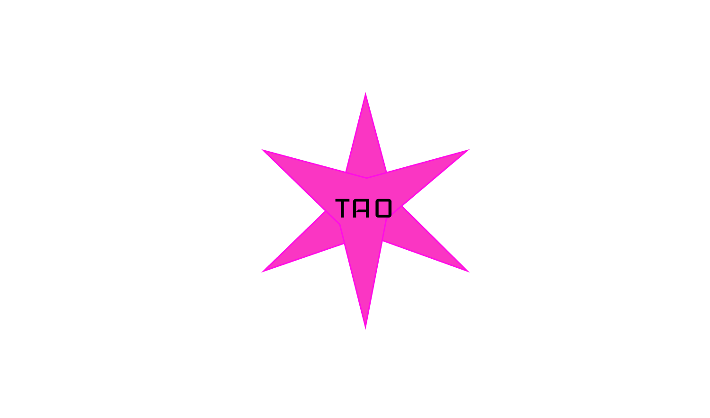

import ImgUp from '@site/static/img/dec_up.svg';
import ImgDown from '@site/static/img/dec_down.svg';
import Header from '@site/docs/img/tao.gif';

# Transformative Autonomous Organizations
Fluid, anonymous, antifragile organizations

###### By Stellar Magnet

<ImgUp className="img-up" />

<ImgDown className="img-down" />

A decentralized autonomous organization (DAO) is a group organized around a common mission that coordinates through a shared set of rules enforced via blockchain technology and social consensus. Over 4,800 DAOs have been created to date, managing over $7B in assets (based on current market value) [1](#references).

DAOs allow humans to experiment with organization design and economics with greater ease than traditional fiat-based organizations, since smart contracts and code are typically at the core of a DAO. They have the potential to scale organizations in a way that enables more worker-autonomy and squad wealth [2](#references).

Nowadays, a DAO in most cases is an organization whose assets are managed by a smart contract. This can potentially mean a multisignature wallet with a handful of signers or even a token plutocracy with a CEO or Executive Director, which is not very inspiring for decentralization purists.

Gabriel Shapiro, DAO aficionado and legal hacker, recently published the article _[Defining Real and Fake DAOs](https://lexnode.substack.com/p/defining-real-and-fake-daos?s=r)_ where he states:

> “The term ‘DAO’ is applied to so many different organizations that it has become close to meaningless. I aim to correct this.”

Shapiro then goes on to emphasize why DAOs should be _decentralized_, _autonomous_, _organizations_ and defines the terms. I definitely appreciate his efforts of trying to nudge the crypto community towards a more ideological definition of what a real DAO is. However, I believe that this ship has unfortunately sailed, and since the term has been appropriated by varying organization forms, I’m comfortable with giving up implanting my vision of what the ideal DAO should look like. The term DAO can be sacrificed to the god of coordination failure: Moloch [3](#references).

Instead of trying to redirect the DAO classification to be more meaningful, we should invent and propose alternative organizational systems with strong principles that are more specific, ideological, and challenge the status quo - to create schelling points around them. 

The [DisCO](https://disco.coop/) community has somewhat attempted this, but instead of calling a DisCO a *type* of DAO, they seem to be against the DAO community. I believe this anti-DAO narrative just adds a hurdle in adoption of the model, since by rejecting DAOs, they also reject the virality currently ascribed to DAOs. An alternative to this is to embrace the strong experimentation that exists within the DAO community and introduce DAO subtypes.

## Introducing TAOs

The Transformative Autonomous Organization, or TAO, can be considered a type of DAO. TAOs don't exist today in practice, but is a newly proposed model of crypto governance to nudge humanity closer to a world where we minimize dystopia and maximize harmony within the cosmos. They are smart contract based organizations that embrace software’s more nimble nature and reject the rigidity of corporate code, tradition, or efficiency.

TAOs are **transformative**. As software-based organizations, their governance is easily transformable and they intend to also transform organizations to become more collaborative as a whole.

TAOs are **autonomous**. Members of a TAO have the freedom to govern and control its affairs. TAOs intend to use artificial intelligence as a side kick, as opposed to an overlord, to reduce the work week and eventually, end labor.

TAOs are **organizations**. A TAO is an organized body with a _meaningful purpose_, especially a group, association, or coalition that intends to make the exploitive and restrictive aspects of business and professionalism obsolete.

They are inspired by cooperatives, Jo Freeman’s _The Tyranny of Structurelessness_, writings of Abdullah Öcalan and Murray Bookchin, Rachel-Rose O’Leary’s [Lunarpunk thesis](https://www.egirlcapital.com/writings/107533289), and Robert Anton Wilson’s [RICH Economy](https://web.archive.org/web/20100613011108/http://whywork.org/rethinking/whywork/rawilson.html).

Smart contracts to support a TAO would be much more complex than the traditional DAO of today, since they will more natively support de facto leadership bodies, mergers, coalitions, and fractalized governance. With TAOs, an organization’s power dynamics can better adapt to conflict or adversarial scenarios, changes in the world, and large-scale organizational growth. TAOs aim to be [antifragile](https://en.wikipedia.org/wiki/Antifragility).

## Six Pillars of TAO
TAOs will share six pillars that are described below. If an organization adopts these pillars, then they can be considered a TAO.

### Autonomously Adaptive
TAOs are highly adaptive organizations, composed of an autonomous membership class that are able to transform their organization's governance to become more hierarchical or more distributed as needed, easily flipping between modes. Establishing and dismantling hierarchies is easy and acceptable, yet always a member decision. TAOs favor _incorruptible_ democratic, representative, or experimental blended decision-making models over pure _token-weighted plutocracies_. Voting models that are closer (yet not necessarily equal to) _one person, one vote_ that provide voter anonymity, are favored over transparent models weighted based on capital contribution.

> "Once the movement no longer clings tenaciously to the ideology of "structurelessness," it is free to develop those forms of organization best suited to its healthy functioning. This does not mean that we should go to the other extreme and blindly imitate the traditional forms of organization. But neither should we blindly reject them all."
>
> -- Jo Freeman

### Anonymous Core
TAOs are lunarpunk and have an anonymous core, where by default, a TAO's treasury, spending, participants, and voting activity is fully anonymous. A TAO can decide to selectively disclose different aspects of their operations, dependending on the use case. Basically, full privacy, secrecy, and anonymity may be necessary for some type of TAOs, while others will benefit from revealing leadership groups or treasuries.

> "Lunarpunk is more like a forest. A dense cover of encryption protects tribes and offers sanctuary for the persecuted. Wooded groves provide a crucial line of defense. Lunar landscapes are dark. They are also teeming with life." 
>
> -- Rachel-Rose O'Leary

### Aim to End Labor
TAOs are interested in building towards a _free society_ where labor has ended. When productivity gains are enabled by advancements in technology, then ideally lives should improve, as opposed to the current dystopia where for example, wages for blue collar workers do not accelerate in the same way as the price of housing. This pillar aims to catalyze a culture where we continuously imagine how a world without labor functions, and to attempt experiments that will propel society towards a direction where one's basic needs are met when born into the world.

> "Let us regard wage-work -- as most people do, in fact, regard it -- as a curse, a drag, a nuisance, a barrier that stands between us and what we really want to do. In that case, your job is the disease, and unemployment is the cure."
>
> -- Robert Anton Wilson

### Concerned for the Cosmos
TAOs are conscious of their relationship with the resources they extract from the cosmos and the labor conditions of their supply chain and they seek to ultimately maximize harmony over profits. In the beginning stages of TAO development (Years 1 - 5), it will be difficult for individual TAOs to do the best they can to maximize harmony, as the legacy systems are both pervasive and entrenched in pollution and slavery while harmonious models are more costly and potentially nonexistant. But the goal is that as more TAOs are created, that over time, maximizing harmony becomes easier and more affordable and legacy systems become obsolete. Nowadays, virtually all businesses and organizations are doing performative steps to signal "sustainability", "ecological awareness", etc. Guidelines to distinguish sincere methods from greenwashing will be important to uphold this pillar.

> "Our planet is a lonely speck in the great enveloping cosmic dark. In our obscurity, in all this vastness, there is no hint that help will come from elsewhere to save us from ourselves."
>
> -- Carl Sagan

### Exist in Networks of Cooperation
TAOs have mechanisms that encourage and facilitate cooperation by joining coalitions or proposing mergers with other TAOs. TAOs will consider merging or joining a coalition with another TAO with a similar mission before competing with them. Mergers are recommended for TAOs operating in similar regions with very similar cultural conditions, whereas coalitions can be composed of TAOs that have a unified mission yet operate in different regions or with different cultural conditions. Healthy competition is encouraged among early stage TAOs, but mergers or coalitions should be considered once the strengths of each TAO become obvious. The aim is that a cooperative mentality at the network level will enable TAOs to strengthen one another. 

> "Democratic confederalism is based on grass-roots participation. Its decision-making processes lie with the communities. Higher levels only serve the coordination and implementation of the will of the communities that send their delegates to the general assemblies. For limited space of time they are both mouthpiece and executive institutions. However, the basic power of decision rests with the local grass-roots institutions."
>
> -- Abdullah Öcalan

### Embrace Experimentation
TAOs embrace being part of an evolving experiment in organization design and alternative economics for the purpose ultimately contributing toward the creation of [parallel societies](https://en.wikipedia.org/wiki/Parallel_society) where dystopia is minimized. Many of the pillars of a TAO include goals which are very difficult to achieve, hence experimentation needs to also be a key pillar, due to the many unknowns in the path towards self-administration. TAOs will share the results of their experiments with the broader community to help strengthen the collective knowledgebase.

> "There can be no separation of the revolutionary process from the revolutionary goal. A society based on self-administration must be achieved by means of self-administration."
>
> -- Murray Bookchin

--- 

_The rest of this paper will focus the most on the **Autonomously Adaptive** pillar of TAOs. This is definitely not a comprehensive design, as many areas still need to be elaborated on and investigated in practice. Comments and feedback are very appreciated (share them in the [#🔄-taos](https://discord.gg/ZqYAbA6BVY) channel)._

## TAOs are Autonomously Adaptive
TAOs favor _incorruptible_ democratic, representative, or experimental blended decision-making models over pure _token-weighted plutocracies_. Essentially, decision-making models that are most effective at taking into account the needs of all stakeholder groups, while enabling voter anonymity, are desired over transparent models weighted based on capital contribution alone. 

One of the other main differences between a TAO and a traditional DAO is that a TAO has two native transformation capabilities. One is a _Leadership Transformation_ which relates to transforming the primary leadership body that manages the TAO. The other is a _Structural Transformation_ which relates to the fractalization of a TAO into smaller parts or the symbiosis of multiple TAOs converging into a unified whole. 

The next sections describe these **autonomously adaptive** properties in more detail.

### Democratic-ish voting with strong privacy
Anonymity is an important property for TAOs and since they are smart contract based organizations, a tradeoff has to be made when it comes to enabling both a _strong democracy_ and _strong privacy_. Since private, decentralized, and sybil-resistant identity solutions are at a very nascent stage of technological development, TAOs should consider initially favoring voting models based on how much one is actively contributing to the organization, since one person, one vote is more technically challenging to achieve. In this use case, sybil resistance is based on the limits of human contribution. Some sample voting weights can be:

* 1x - Earned an average of at least (x) tokens / week over the last (z) months 
* 2x - Earned an average of [(x+1) to (y-1)] tokens / week over the last (z) months
* 3x - Earned an average of (y) or more tokens / week over the last (z) months

Note: TAOs are not a recommended model for how to actually govern a society and their application should be limited in scope towards organizations, as is implied by the "O" in TAO.

### Nimble network topology
The network topology of a TAO is nimble. A TAO can remain simple, where there is only a singular treasury, or it can become more fractalized with _Structural Transformation Proposals_. Such proposals are required to empower or disempower a **sub-TAO** or **sister-TAO** or to join or leave a **super-TAO**. These topological bodies are described in the next sections.

Members of a TAO can decide to empower **sub-TAOs**, which are guilds that are responsible for different focus areas / workstreams. There will be at least one smart contract per sub-TAO, enabling management of independent treasuries, yet the origination TAO has control over disbanding the sub-TAO. Sub-TAOs are tightly coupled to a "parent TAO".

Another formation is that a TAO can decide to empower a **sister-TAO** which would be similar to a sub-TAO with one main difference: there isn't a revokable treasury, yet what can be revoked is the general affiliation between the two sister TAOs. Usually a sister-TAO can be formed when its performing a function that can be beneficial to other distinct TAOs.

An individual sub-TAO or sister-TAO has autonomy over how it is governed. For example, the sub-TAO can transform from a member-led direct democracy to an organization where leadership functions are granted to a steward or set of stewards. A TAO can also include a combination of sub-TAOs and sister-TAOs. 

Similar to how easily TAOs can fractalize into smaller parts, they can also just as easily combine into larger parts. TAOs can form mergers, where two distinct and independent TAOs decide to unify their treasury and unify their membership class. TAOs can also form into **super-TAOs**, which is a "TAO of TAOs" topology, where two or more independent TAOs unify over a common mission or strategy, yet have independent treasuries. The primary governance activities in a super-TAO would be determining the budget allocation and responsibilities per member organization and adding or removing sister organizations.

### Adaptable and antifragile leadership paradigms
TAOs are highly adaptive organizations, composed of an autonomous membership class that are able to transform their organization's leadership to become more hierarchical or more distributed as needed, easily flipping between modes by the creation of _Leadership Transformation Proposals_. Leadership transformations are only applied at a _local_ level in TAOs, meaning that if the TAO contains sub-TAOs their leadership will remain unchanged. At the most basic level, potential leadership bodies will include: **the membership class**, an electable set of **multiple stewards**, or an electable **singular steward**.

Stewards within a TAO practice _[leadership as hospitality](https://www.microsolidarity.cc)_. Empowering stewards to be responsible for a function of the organization are considered temporary, revokable responsibilities (e.g. once steward(s) are empowered, their power has limits that are ultimately at the mercy of the primary membership class). When there are multiple stewards, they can either be elected based on a liquid model or there can be a more standard election with term lengths. Stewards should be compensated from the TAO treasury.

TAOs will include an _Antifragile Mode_ parameter. With _Antifragile Mode_ enabled, organizations can enact immediate, emergency transformations to an alternative leadership paradigm. To support this, there is an election proposal that is perpetually open where TAO members can anonymously vote on **the de facto stewards** that would be empowered, should the organization need to immediately transform - whether that is to replace the current steward or select stewards in the case where the organization is currently led by the membership class. Nobody in the TAO knows who the de facto steward(s) are until the transformation is finalized. De facto steward(s) will be in power for a limited amount of time, which will be specified in the _Leadership Transformation Proposal_. After such transformations, TAO members reflect on the incident and may prepare proposals for fine-tuning the organization's longer-term structure or governance, which lends towards this parameter's _antifragile_ name.

:::note NOTE
These are just some initial thoughts on what a TAO ecosystem can look like. It will be important moving forward to go a bit deeper on all of the pillars. Next, I'm going to finally advance my software engineering so I can start building some of these primitives on Dark.Fi. Join the [#🔄-taos](https://discord.gg/ZqYAbA6BVY) channel in the Black Sky Discord if you want to collaborate, or propose changes by [editing this page](https://github.com/BlackSkyNetwork/nexus/edit/main/docs/zine/00000000/transformative-autonomous-organizations.mdx).
:::

_Thank you Peter Phillips for providing comments and feedback that helped me shape TAO governance._

## References
1. DeepDAO. (n.d.). DeepDAO. Retrieved June 20, 2022, from https://deepdao.io/organizations

2. Hart, S., Shorin, T., & Lotti, L. (2020, August 19). Squad Wealth. Other Internet. Retrieved June 20, 2022, from https://otherinter.net/research/squad-wealth/

3. Alexander, S. (2014, July 30). Meditations on Moloch. Slate Star Codex. Retrieved June 20, 2022, from https://slatestarcodex.com/2014/07/30/meditations-on-moloch/