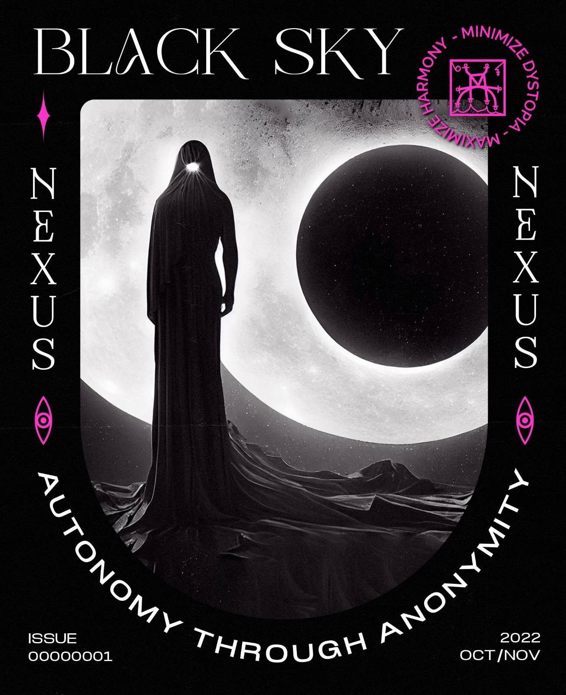

###### 00000001 Foreword
Crypto is a countercultural movement that functions similar to a vortex, absorbing the curious who happen to fall into its pull, typically individuals who have been yearning for legitimate alternatives to a society of subjection in which top-down coercion is reinforced through fiat currencies, impenetrable bureaucracy, and ubiquitous surveillance. Crypto draws people towards a current outside of, and away from, traditional institutions. Crypto adherents are a diverse group, whose ideologies and visions differ along geographical, cultural, and political divides. The movement is heterogenous, with different members having divergent, sometimes contradictory goals. Due to the fundamentally decentralized nature of crypto, this means its discourse, ideology, and praxis necessarily depend on the groups who take part in the movement.
 
Cryptocurrency emerged from a group who came to be known as cypherpunks, the movement arising in the intellectually bustling scene of the early ’90s Bay Area culture. The cypherpunks sought to liberate themselves from mechanisms of socioeconomic control through the wide scale use of digital cryptography, once monopolized by global militaries, and also by creating a fully encrypted financial and communication ecosystem as a framework for combating state surveillance and control. These ideas were initially surfaced through the eponymous cypherpunk mailing list, which was also where Satoshi Nakamoto first introduced Bitcoin in 2008.
 
A key opening line from *A Cypherpunk’s Manifesto* by Eric Hughes, a founding member of the cypherpunk movement, lays out the foundational notion: “Privacy is the power to selectively reveal oneself to the world,” honing in on privacy as power. Where the ability to selectively choose is the manifestation of that power. Yet, since Hughes wrote these words in 1993, autonomy and anonymity online has decreased exponentially in tandem with the growing complexity of the internet itself.
 
Corporate surveillance now follows in the footsteps of a long tradition of state surveillance and control, that of powerful covert programs like Echelon, COINTELPRO, and PRISM. Modern corporations survey supposedly “protected” corners of cyberspace like an open book, gaining unrestricted and non-consensual access to data which can be used as “intelligence.” The state has a long history of persecuting data-sharing sites like Napster and Pirate Bay and shutting down agorist markets like Silk Road, acting in the name of intellectual property and anti-terrorist laws to secure its powers of surveillance and taxation. In the current zeitgeist, statist and corporate interests have aligned in a convergent war against the digital commons, free trade, and those seeking sovereignty.
 
Despite the general ethos of anarchic decentralization, and the immense innovation in decentralized finance and coordination tools, crypto has not been immune to the reach of the double-headed beast of state surveillance and control. The cypherpunks’ vision of a decentralized financial system has almost been forgotten in the frenzy of hacks, scams, and self-promotion. In contrast to the “number-go-up” mentality of the new crypto-greed, the web3 community saw the emergence of a new ethos: solarpunk, which grew out of cypherpunk. The solarpunk mentality rejects zero-sum individual wealth accumulation and focuses instead on the creation of technological public goods, the synergy between crypto and regenerative agriculture, and positive-sum community building. While these admirable aims have provided new life and energy to the crypto movement, the solarpunk vision is insufficiently critical of the existing technological landscape. By partnering with mainstream venture capital, solarpunk’s countercultural momentum has been unwittingly co-opted into entanglement with state surveillance and control. Most of all, the solarpunk vision has forgotten that privacy is a core tenet of the crypto free-world.
 
Satoshi’s dream of “a purely peer-to-peer version of electronic cash” is constantly challenged by the pervasive forces of Moloch. Invasive KYC programs, aggressive legal cases by the SEC and CFTC, and state sanctions against Tornado Cash are the latest existential challenges in the fight for sovereignty of our grassroots online communities and economies. The rules, structures, and control mechanisms of the fiat world are infiltrating crypto. The movement is at a point of criticality. Crypto risks having its counterculture pushed underground again, while the majority market share is recruited into supporting the development of authoritarian technologies like CBDCs and mass surveillance.
 
However, there is an alternative. Solarpunks can integrate the shadow-self of the lunarpunk and revitalize the cypherpunk spirit to overcome the grip of the old world order. Lunarpunks believe cryptocurrency communities need to reclaim anonymity, believing this to be crucial in establishing a real separation between crypto and fiat. This clean break is needed in order to regenerate a moral and political society in tune with the autonomous spirit of humanity. While lunarpunk mythos does not wish to dominate or impose its will on the world, there can be no solarpunk future without the pragmatism and self-defense of the lunarpunk ethos. Either crypto will fragment into fringe countercultures and power structures imitating old institutions or it will demand a fight to secure the original cypherpunk vision held vividly in the community’s collective consciousness. The esoteric qualities of lunarpunk: cold, dark, transformative, are the complementary opposites of solarpunk: warm, rose-tinted, progressive.
 
Issue 0000001 of *Black Sky Nexus* discusses the larger theme of achieving *autonomy through anonymity*. We are publishing articles iteratively with a digital publication date for the entire issue set for late November. The initial set of articles feature privacy-centric research, guides to steer development to adopt cypherpunk principles, resources for enhanced anonymity, in addition to general editorials aligned with the theme. In the meantime, we are [open for submissions](/zine/00000001/call-for-submissions) and actively seek additional material for this issue.

*Special thanks to MolochDAO, DAOsquare, and anonymous donors whose funding has been instrumental in producing this issue.*

--- 
<a href="../../zine/00000001/cypherpunk-your-adversaries">Cypherpunk Your Adversaries</a>

###### By Stellar Magnet, Samadhi, UniPuff
---
<a href="../../zine/00000001/anon-guide">An Initiation into the Realm of Crypto Anonymity</a>

###### By UniPuff, Stellar Magnet

---
<a href="../../zine/00000001/fight-for-cryptography">The Fight for Cryptography in the War Against Sovereignty</a>

###### By Ameen Soleimani

--- 
<a href="../../zine/00000001/anoma-protocol">Anoma Protocol</a>

###### By Stellar Magnet, Serinko
--- 